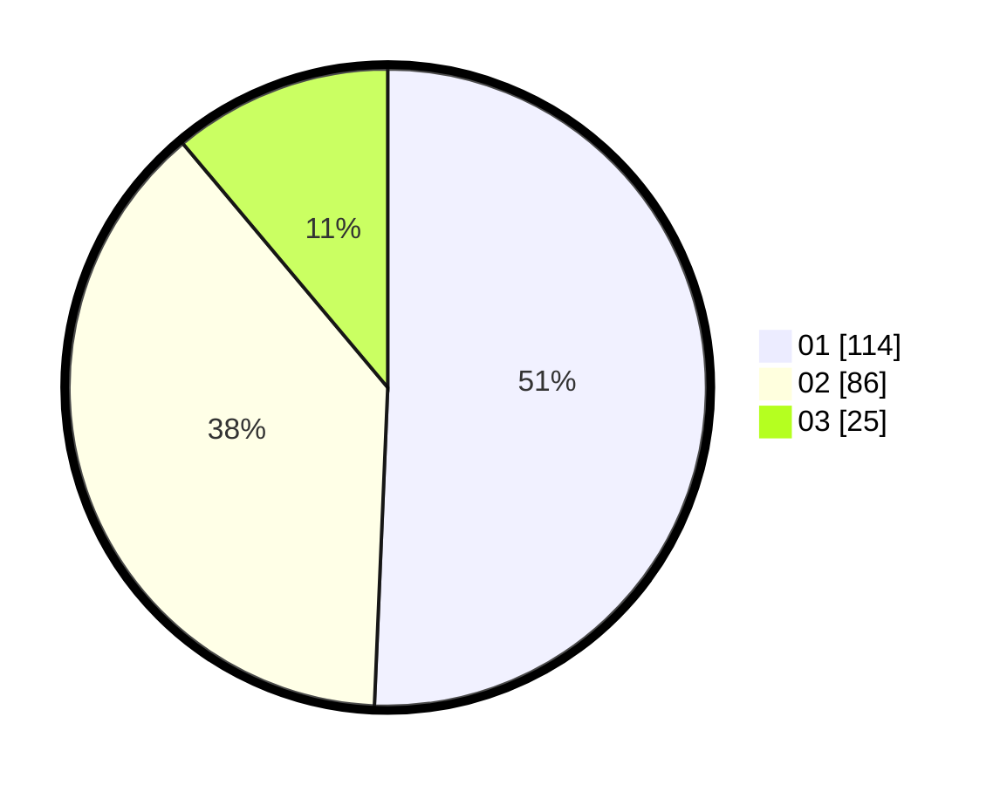

# Hasil

Hasil perolehan suara paslon dapat dilihat pada file paslon-01.txt, paslon-02.txt, dan paslon-03.txt.

Jika tidak ada, artinya data tersebut belum ada pada SIREKAP.

## Perolehan Suara

 * Paslon 01: **114**.
 * Paslon 02: **86**.
 * Paslon 03: **25**.

## Foto C Plano

https://sirekap-obj-formc.kpu.go.id/1337/pemilu/ppwp/31/74/01/10/05/3174011005065-20240214-160103--c61b08c8-bb3e-4fc4-8b10-f33acb24dfc7.jpg

https://sirekap-obj-formc.kpu.go.id/1337/pemilu/ppwp/31/74/01/10/05/3174011005065-20240214-162226--59ff99a2-b9d8-4bd3-95b4-93bc19cb5233.jpg

https://sirekap-obj-formc.kpu.go.id/1337/pemilu/ppwp/31/74/01/10/05/3174011005065-20240216-130514--10fb9495-9eac-4d62-9783-f0c9fa5af22a.jpg

## DATA PEMILIH TETAP

Jumlah pemilih dalam DPT: **280**.
 * L: **147**.
 * P: **133**.

## DATA PENGGUNA HAK PILIH

Jumlah pengguna hak pilih dalam DPT: **226**.
 * L: **116**.
 * P: **110**.

Jumlah pengguna hak pilih dalam DPTb: **2**.
 * L: **1**.
 * P: **1**.

Jumlah pengguna hak pilih dalam DPK: **3**.
 * L: **1**.
 * P: **2**.

Jumlah pengguna hak pilih: **231**.
 * L: **118**.
 * P: **113**.

## JUMLAH SUARA SAH DAN TIDAK SAH

JUMLAH SELURUH SUARA SAH: **225**.

JUMLAH SUARA TIDAK SAH: **6**.

JUMLAH SELURUH SUARA SAH DAN SUARA TIDAK SAH: **231**.
