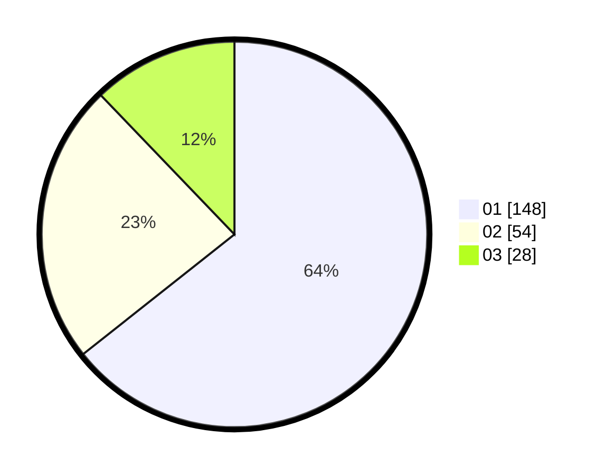

# Hasil

Hasil perolehan suara paslon dapat dilihat pada file paslon-01.txt, paslon-02.txt, dan paslon-03.txt.

Jika tidak ada, artinya data tersebut belum ada pada SIREKAP.

## Perolehan Suara

 * Paslon 01: **148**.
 * Paslon 02: **54**.
 * Paslon 03: **28**.

## Foto C Plano

https://sirekap-obj-formc.kpu.go.id/3857/pemilu/ppwp/31/74/01/10/05/3174011005069-20240214-155732--96188e4e-1c5b-4b12-93ff-79dcbf45b41d.jpg

https://sirekap-obj-formc.kpu.go.id/3857/pemilu/ppwp/31/74/01/10/05/3174011005069-20240214-155754--b93c1586-ac5d-47a7-bf94-9355872aafaa.jpg

https://sirekap-obj-formc.kpu.go.id/3857/pemilu/ppwp/31/74/01/10/05/3174011005069-20240214-155809--6181ea7b-4d59-4a00-aeef-0eaf8f317edd.jpg
