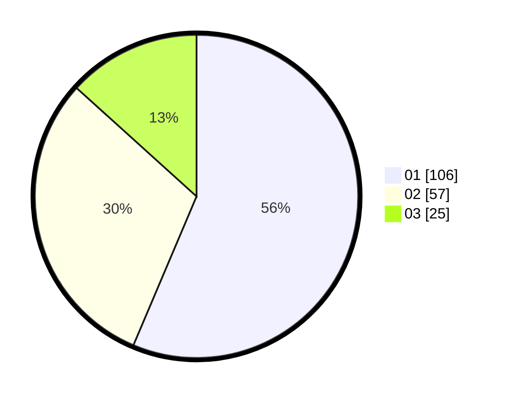

# Hasil

Hasil perolehan suara paslon dapat dilihat pada file paslon-01.txt, paslon-02.txt, dan paslon-03.txt.

Jika tidak ada, artinya data tersebut belum ada pada SIREKAP.

## Perolehan Suara

 * Paslon 01: **106**.
 * Paslon 02: **57**.
 * Paslon 03: **25**.

## Foto C Plano

https://sirekap-obj-formc.kpu.go.id/68db/pemilu/ppwp/31/74/01/10/05/3174011005071-20240214-155434--f7208f1c-cec1-4a09-a614-ec7af5e0d6ea.jpg

https://sirekap-obj-formc.kpu.go.id/68db/pemilu/ppwp/31/74/01/10/05/3174011005071-20240214-155515--7938dc86-d61f-477e-bfac-30b72804d6f9.jpg

https://sirekap-obj-formc.kpu.go.id/68db/pemilu/ppwp/31/74/01/10/05/3174011005071-20240214-191048--c3d9bd9b-e76c-4704-bf2a-f6daf714aa05.jpg

## DATA PEMILIH TETAP

Jumlah pemilih dalam DPT: **210**.
 * L: **107**.
 * P: **103**.

## DATA PENGGUNA HAK PILIH

Jumlah pengguna hak pilih dalam DPT: **176**.
 * L: **88**.
 * P: **88**.

Jumlah pengguna hak pilih dalam DPTb: **1**.
 * L: **1**.
 * P: **0**.

Jumlah pengguna hak pilih dalam DPK: **13**.
 * L: **6**.
 * P: **7**.

Jumlah pengguna hak pilih: **190**.
 * L: **95**.
 * P: **95**.

## JUMLAH SUARA SAH DAN TIDAK SAH

JUMLAH SELURUH SUARA SAH: **188**.

JUMLAH SUARA TIDAK SAH: **2**.

JUMLAH SELURUH SUARA SAH DAN SUARA TIDAK SAH: **190**.
