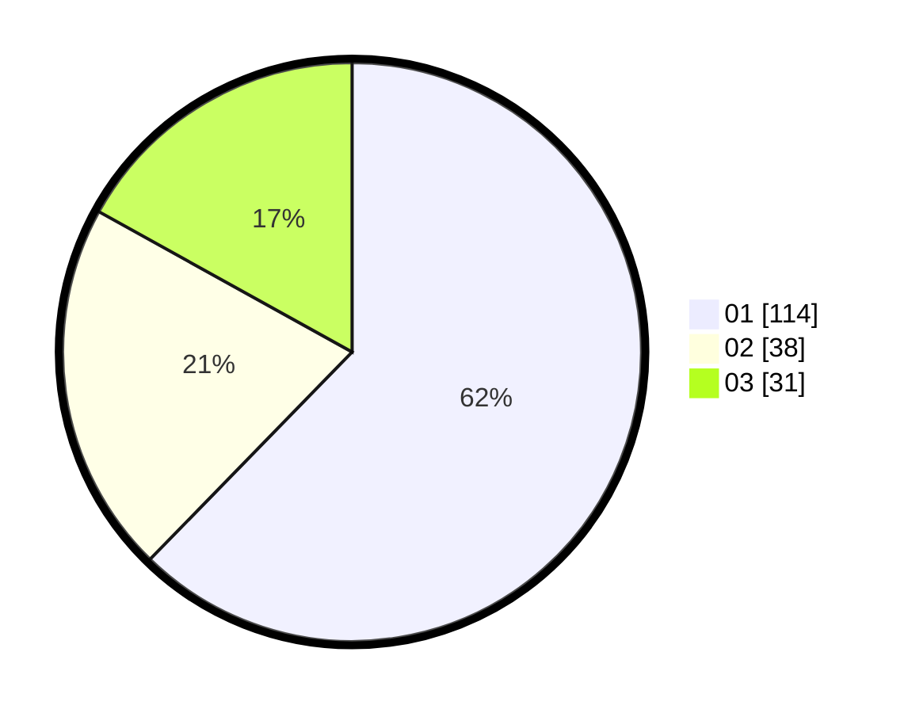

# Hasil

Hasil perolehan suara paslon dapat dilihat pada file paslon-01.txt, paslon-02.txt, dan paslon-03.txt.

Jika tidak ada, artinya data tersebut belum ada pada SIREKAP.

## Perolehan Suara

 * Paslon 01: **114**.
 * Paslon 02: **38**.
 * Paslon 03: **31**.

## Foto C Plano

https://sirekap-obj-formc.kpu.go.id/d291/pemilu/ppwp/31/74/01/10/05/3174011005077-20240214-202546--b5bdc744-3158-4296-b288-d8572f58075e.jpg

https://sirekap-obj-formc.kpu.go.id/d291/pemilu/ppwp/31/74/01/10/05/3174011005077-20240214-194230--38224b29-1cd8-4e29-905b-68ed4b89932e.jpg

https://sirekap-obj-formc.kpu.go.id/d291/pemilu/ppwp/31/74/01/10/05/3174011005077-20240214-202924--20bf7d46-b22e-4f2a-84c8-9bd22eaf3419.jpg
