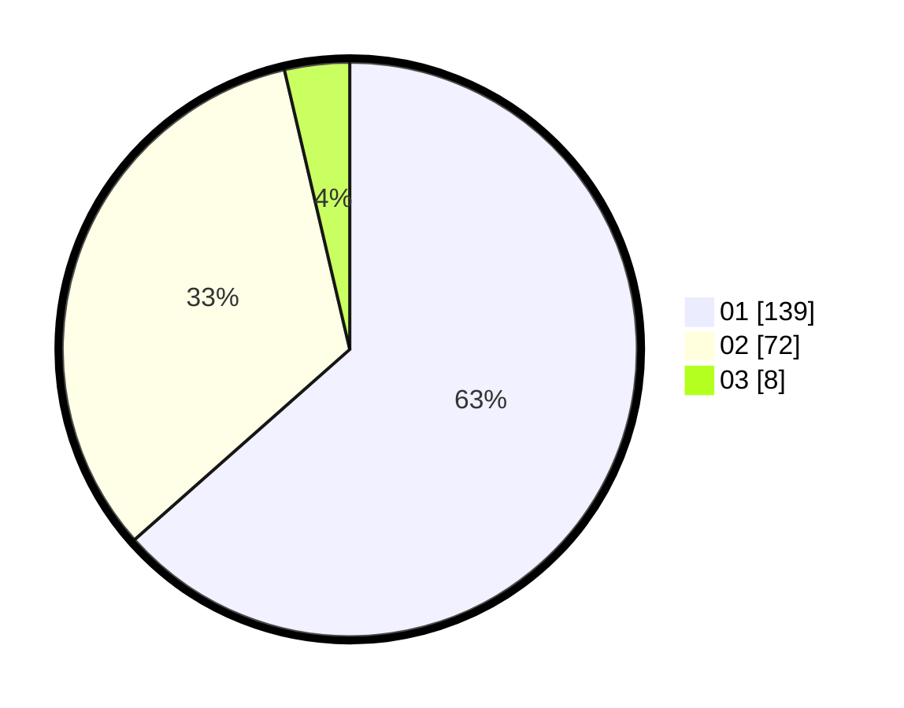

# Hasil

Hasil perolehan suara paslon dapat dilihat pada file paslon-01.txt, paslon-02.txt, dan paslon-03.txt.

Jika tidak ada, artinya data tersebut belum ada pada SIREKAP.

## Perolehan Suara

 * Paslon 01: **139**.
 * Paslon 02: **72**.
 * Paslon 03: **8**.

## Foto C Plano

https://sirekap-obj-formc.kpu.go.id/6bec/pemilu/ppwp/31/74/01/10/05/3174011005094-20240216-144715--a0245a4a-1879-4449-babd-8596f166b990.jpg

https://sirekap-obj-formc.kpu.go.id/6bec/pemilu/ppwp/31/74/01/10/05/3174011005094-20240216-144716--46156a37-5c07-4319-9cbe-d37a1937ff0a.jpg

https://sirekap-obj-formc.kpu.go.id/6bec/pemilu/ppwp/31/74/01/10/05/3174011005094-20240216-144715--3c54fa0d-9d26-4c84-9f1a-68488e0a4e9a.jpg

## DATA PEMILIH TETAP

Jumlah pemilih dalam DPT: **279**.
 * L: **154**.
 * P: **125**.

## DATA PENGGUNA HAK PILIH

Jumlah pengguna hak pilih dalam DPT: **216**.
 * L: **115**.
 * P: **101**.

Jumlah pengguna hak pilih dalam DPTb: **2**.
 * L: **0**.
 * P: **2**.

Jumlah pengguna hak pilih dalam DPK: **1**.
 * L: **0**.
 * P: **1**.

Jumlah pengguna hak pilih: **219**.
 * L: **115**.
 * P: **104**.

## JUMLAH SUARA SAH DAN TIDAK SAH

JUMLAH SELURUH SUARA SAH: **219**.

JUMLAH SUARA TIDAK SAH: **0**.

JUMLAH SELURUH SUARA SAH DAN SUARA TIDAK SAH: **219**.
