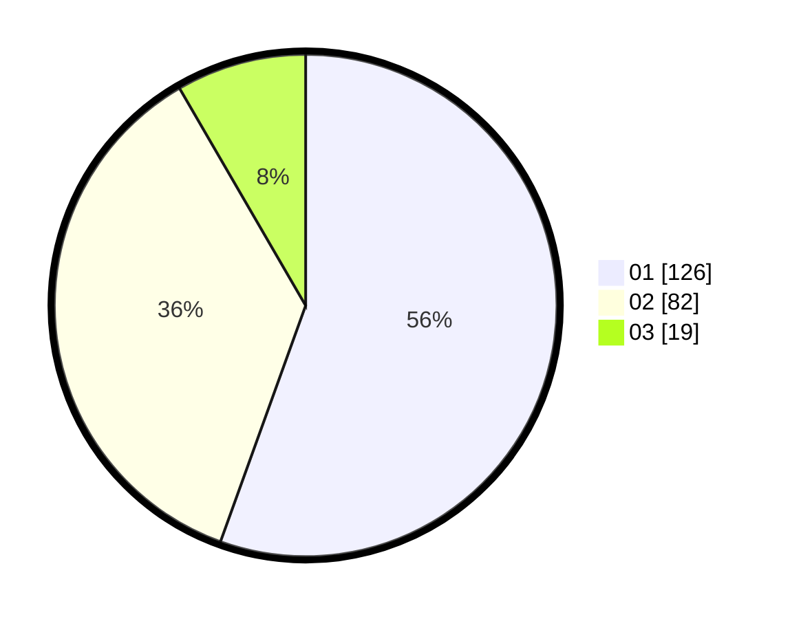

# Hasil

Hasil perolehan suara paslon dapat dilihat pada file paslon-01.txt, paslon-02.txt, dan paslon-03.txt.

Jika tidak ada, artinya data tersebut belum ada pada SIREKAP.

## Perolehan Suara

 * Paslon 01: **126**.
 * Paslon 02: **82**.
 * Paslon 03: **19**.

## Foto C Plano

https://sirekap-obj-formc.kpu.go.id/5fb2/pemilu/ppwp/31/74/01/10/05/3174011005101-20240215-223118--352f0964-df32-4ebd-92cc-191e9115d6cb.jpg

https://sirekap-obj-formc.kpu.go.id/5fb2/pemilu/ppwp/31/74/01/10/05/3174011005101-20240214-234625--c4a1f2b0-2f6c-41c4-9ae2-f5ebb37ae8e0.jpg

https://sirekap-obj-formc.kpu.go.id/5fb2/pemilu/ppwp/31/74/01/10/05/3174011005101-20240214-234647--b9e099d2-e607-4989-ae5a-c92fe0389b9a.jpg

## DATA PEMILIH TETAP

Jumlah pemilih dalam DPT: **271**.
 * L: **136**.
 * P: **135**.

## DATA PENGGUNA HAK PILIH

Jumlah pengguna hak pilih dalam DPT: **230**.
 * L: **116**.
 * P: **114**.

Jumlah pengguna hak pilih dalam DPTb: **0**.
 * L: **0**.
 * P: **0**.

Jumlah pengguna hak pilih dalam DPK: **2**.
 * L: **1**.
 * P: **1**.

Jumlah pengguna hak pilih: **232**.
 * L: **117**.
 * P: **115**.

## JUMLAH SUARA SAH DAN TIDAK SAH

JUMLAH SELURUH SUARA SAH: **227**.

JUMLAH SUARA TIDAK SAH: **5**.

JUMLAH SELURUH SUARA SAH DAN SUARA TIDAK SAH: **232**.
