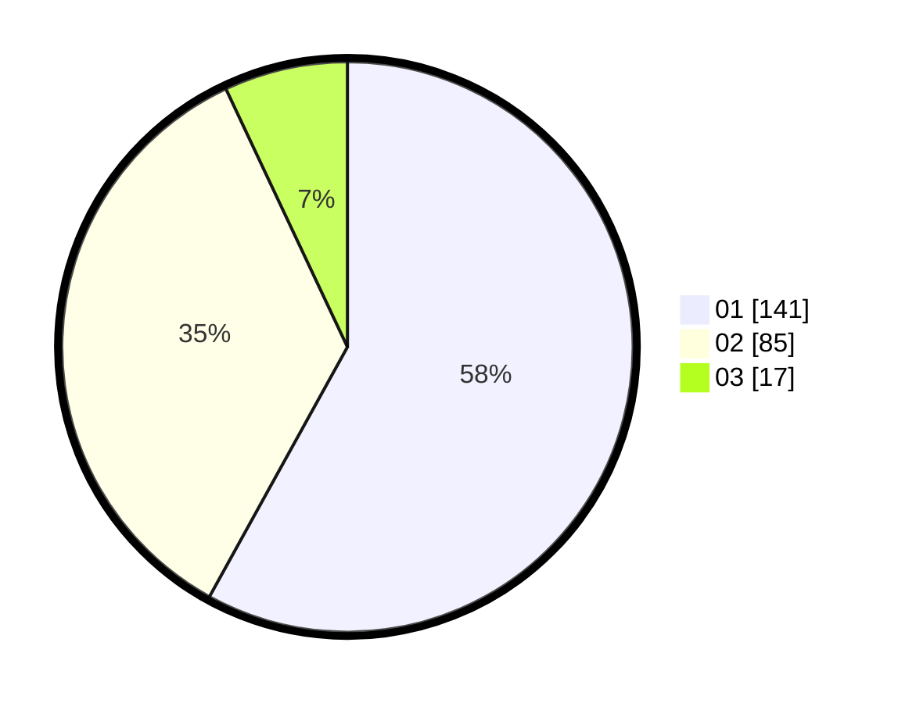

# Hasil

Hasil perolehan suara paslon dapat dilihat pada file paslon-01.txt, paslon-02.txt, dan paslon-03.txt.

Jika tidak ada, artinya data tersebut belum ada pada SIREKAP.

## Perolehan Suara

 * Paslon 01: **141**.
 * Paslon 02: **85**.
 * Paslon 03: **17**.

## Foto C Plano

https://sirekap-obj-formc.kpu.go.id/b1fe/pemilu/ppwp/31/74/01/10/05/3174011005104-20240216-090331--d49048b6-f6c8-4808-a5c8-ac50575c3fe3.jpg

https://sirekap-obj-formc.kpu.go.id/b1fe/pemilu/ppwp/31/74/01/10/05/3174011005104-20240216-090334--d4f193b6-6a50-414c-b7ff-28e991f252e5.jpg

https://sirekap-obj-formc.kpu.go.id/b1fe/pemilu/ppwp/31/74/01/10/05/3174011005104-20240216-090333--3950d556-029b-4a41-aece-015eeda085b2.jpg

## DATA PEMILIH TETAP

Jumlah pemilih dalam DPT: **284**.
 * L: **148**.
 * P: **136**.

## DATA PENGGUNA HAK PILIH

Jumlah pengguna hak pilih dalam DPT: **239**.
 * L: **122**.
 * P: **117**.

Jumlah pengguna hak pilih dalam DPTb: **0**.
 * L: **0**.
 * P: **0**.

Jumlah pengguna hak pilih dalam DPK: **6**.
 * L: **3**.
 * P: **3**.

Jumlah pengguna hak pilih: **245**.
 * L: **125**.
 * P: **120**.

## JUMLAH SUARA SAH DAN TIDAK SAH

JUMLAH SELURUH SUARA SAH: **243**.

JUMLAH SUARA TIDAK SAH: **2**.

JUMLAH SELURUH SUARA SAH DAN SUARA TIDAK SAH: **245**.
