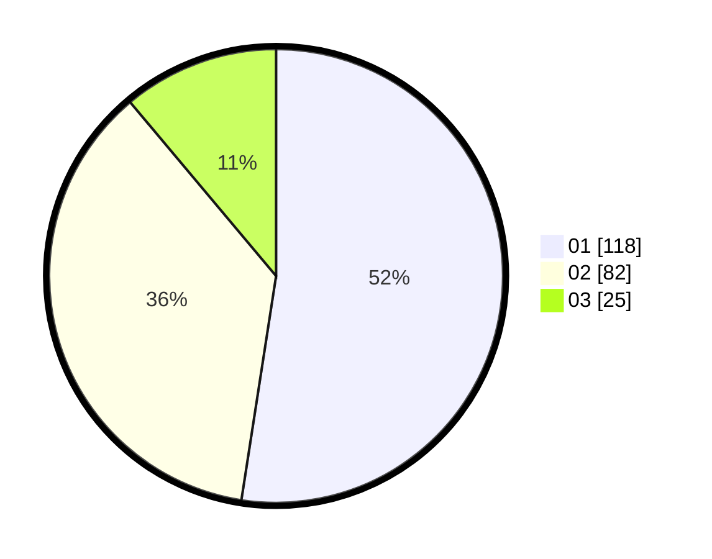

# Hasil

Hasil perolehan suara paslon dapat dilihat pada file paslon-01.txt, paslon-02.txt, dan paslon-03.txt.

Jika tidak ada, artinya data tersebut belum ada pada SIREKAP.

## Perolehan Suara

 * Paslon 01: **118**.
 * Paslon 02: **82**.
 * Paslon 03: **25**.

## Foto C Plano

https://sirekap-obj-formc.kpu.go.id/7503/pemilu/ppwp/31/74/01/10/05/3174011005106-20240214-175325--ac20a82e-345e-4cd6-9057-71a82cd61115.jpg

https://sirekap-obj-formc.kpu.go.id/7503/pemilu/ppwp/31/74/01/10/05/3174011005106-20240214-190924--f7815b46-87bc-4ca2-9efa-55838e2a2da0.jpg

https://sirekap-obj-formc.kpu.go.id/7503/pemilu/ppwp/31/74/01/10/05/3174011005106-20240214-214748--270d200d-71fb-42ee-8519-3c5491097b9c.jpg

## DATA PEMILIH TETAP

Jumlah pemilih dalam DPT: **274**.
 * L: **137**.
 * P: **137**.

## DATA PENGGUNA HAK PILIH

Jumlah pengguna hak pilih dalam DPT: **229**.
 * L: **110**.
 * P: **119**.

Jumlah pengguna hak pilih dalam DPTb: **0**.
 * L: **0**.
 * P: **0**.

Jumlah pengguna hak pilih dalam DPK: **1**.
 * L: **1**.
 * P: **0**.

Jumlah pengguna hak pilih: **230**.
 * L: **111**.
 * P: **119**.

## JUMLAH SUARA SAH DAN TIDAK SAH

JUMLAH SELURUH SUARA SAH: **225**.

JUMLAH SUARA TIDAK SAH: **5**.

JUMLAH SELURUH SUARA SAH DAN SUARA TIDAK SAH: **230**.
