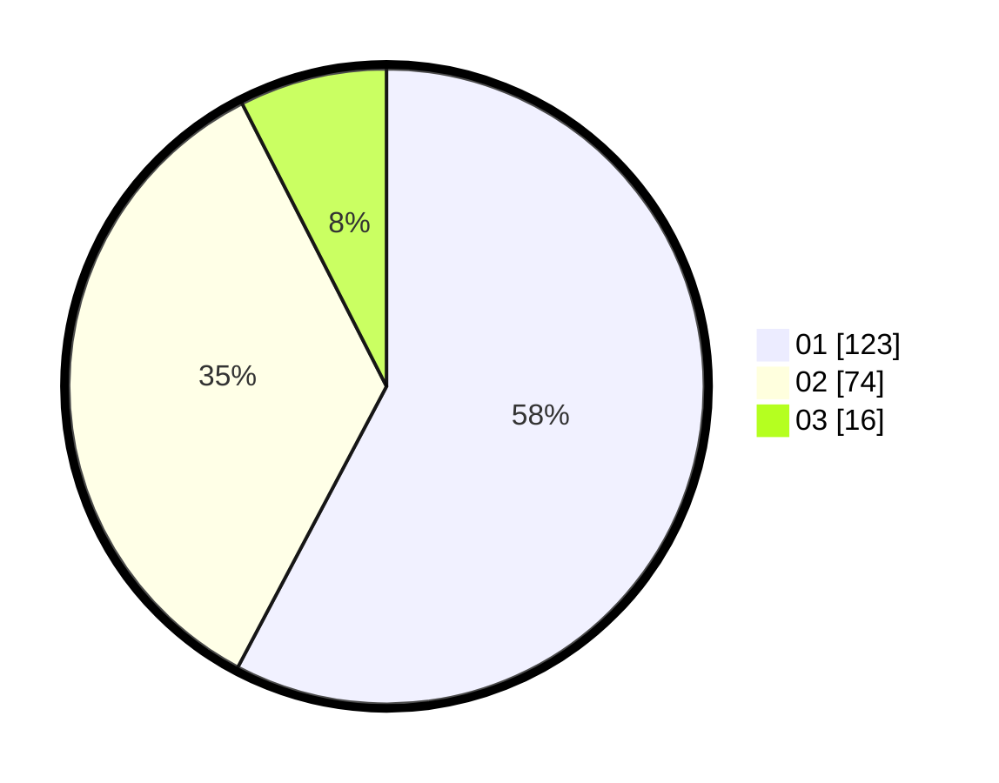

# Hasil

Hasil perolehan suara paslon dapat dilihat pada file paslon-01.txt, paslon-02.txt, dan paslon-03.txt.

Jika tidak ada, artinya data tersebut belum ada pada SIREKAP.

## Perolehan Suara

 * Paslon 01: **123**.
 * Paslon 02: **74**.
 * Paslon 03: **16**.

## Foto C Plano

https://sirekap-obj-formc.kpu.go.id/0b85/pemilu/ppwp/31/74/01/10/05/3174011005107-20240215-002010--7d43ccba-efc5-43f5-a580-1002ba1197ae.jpg

https://sirekap-obj-formc.kpu.go.id/0b85/pemilu/ppwp/31/74/01/10/05/3174011005107-20240215-155951--a0861332-0eac-4b06-9377-24e64065981d.jpg

https://sirekap-obj-formc.kpu.go.id/0b85/pemilu/ppwp/31/74/01/10/05/3174011005107-20240215-124051--1bafe7fe-4e13-4b4d-a298-7c570074bca6.jpg

## DATA PEMILIH TETAP

Jumlah pemilih dalam DPT: **267**.
 * L: **130**.
 * P: **137**.

## DATA PENGGUNA HAK PILIH

Jumlah pengguna hak pilih dalam DPT: **210**.
 * L: **96**.
 * P: **114**.

Jumlah pengguna hak pilih dalam DPTb: **1**.
 * L: **0**.
 * P: **1**.

Jumlah pengguna hak pilih dalam DPK: **2**.
 * L: **1**.
 * P: **1**.

Jumlah pengguna hak pilih: **213**.
 * L: **97**.
 * P: **116**.

## JUMLAH SUARA SAH DAN TIDAK SAH

JUMLAH SELURUH SUARA SAH: **213**.

JUMLAH SUARA TIDAK SAH: **1**.

JUMLAH SELURUH SUARA SAH DAN SUARA TIDAK SAH: **214**.
