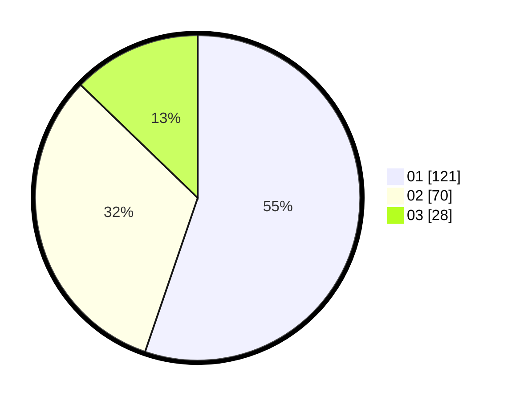

# Hasil

Hasil perolehan suara paslon dapat dilihat pada file paslon-01.txt, paslon-02.txt, dan paslon-03.txt.

Jika tidak ada, artinya data tersebut belum ada pada SIREKAP.

## Perolehan Suara

 * Paslon 01: **121**.
 * Paslon 02: **70**.
 * Paslon 03: **28**.

## Foto C Plano

https://sirekap-obj-formc.kpu.go.id/a15a/pemilu/ppwp/31/74/01/10/05/3174011005109-20240215-035111--bb33b6fc-eacc-4442-8eec-db247a19dd5b.jpg

https://sirekap-obj-formc.kpu.go.id/a15a/pemilu/ppwp/31/74/01/10/05/3174011005109-20240215-035351--7730433a-e161-48e0-b697-21812050bd5a.jpg

https://sirekap-obj-formc.kpu.go.id/a15a/pemilu/ppwp/31/74/01/10/05/3174011005109-20240215-035356--36264c47-2d86-4f43-aab7-c21edc1b931a.jpg
