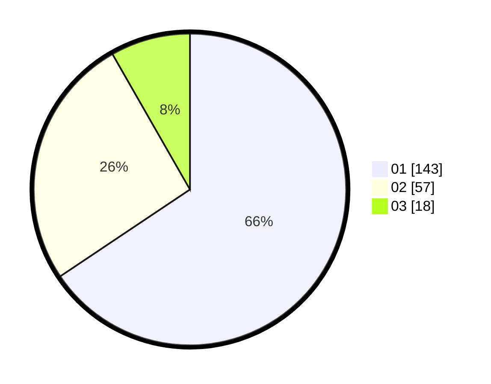

# Hasil

Hasil perolehan suara paslon dapat dilihat pada file paslon-01.txt, paslon-02.txt, dan paslon-03.txt.

Jika tidak ada, artinya data tersebut belum ada pada SIREKAP.

## Perolehan Suara

 * Paslon 01: **143**.
 * Paslon 02: **57**.
 * Paslon 03: **18**.

## Foto C Plano

https://sirekap-obj-formc.kpu.go.id/de28/pemilu/ppwp/31/74/01/10/05/3174011005119-20240214-231745--bd33d3c4-bb2e-4773-893f-97c915e4ec82.jpg

https://sirekap-obj-formc.kpu.go.id/de28/pemilu/ppwp/31/74/01/10/05/3174011005119-20240214-232001--c86e9572-8d75-4f21-a567-977f4801eb02.jpg

https://sirekap-obj-formc.kpu.go.id/de28/pemilu/ppwp/31/74/01/10/05/3174011005119-20240214-232058--7406d988-0c7c-408c-aa24-9a796932f58f.jpg

## DATA PEMILIH TETAP

Jumlah pemilih dalam DPT: **231**.
 * L: **113**.
 * P: **118**.

## DATA PENGGUNA HAK PILIH

Jumlah pengguna hak pilih dalam DPT: **213**.
 * L: **102**.
 * P: **111**.

Jumlah pengguna hak pilih dalam DPTb: **8**.
 * L: **3**.
 * P: **5**.

Jumlah pengguna hak pilih dalam DPK: **2**.
 * L: **0**.
 * P: **2**.

Jumlah pengguna hak pilih: **223**.
 * L: **105**.
 * P: **118**.

## JUMLAH SUARA SAH DAN TIDAK SAH

JUMLAH SELURUH SUARA SAH: **218**.

JUMLAH SUARA TIDAK SAH: **5**.

JUMLAH SELURUH SUARA SAH DAN SUARA TIDAK SAH: **223**.
