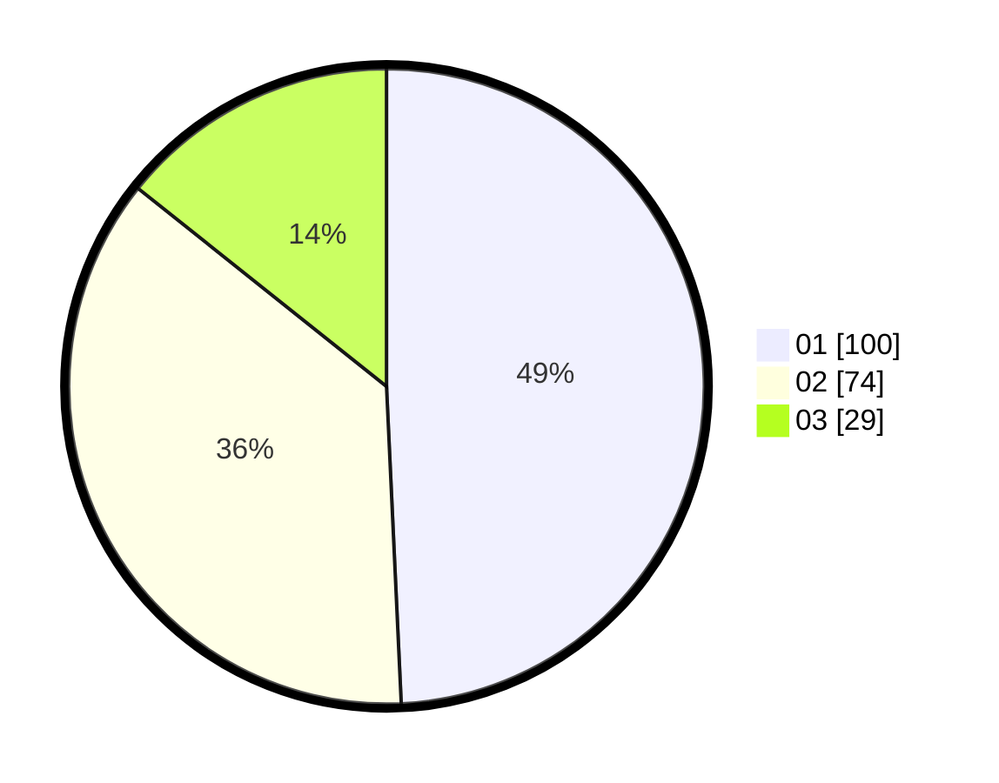

# Hasil

Hasil perolehan suara paslon dapat dilihat pada file paslon-01.txt, paslon-02.txt, dan paslon-03.txt.

Jika tidak ada, artinya data tersebut belum ada pada SIREKAP.

## Perolehan Suara

 * Paslon 01: **100**.
 * Paslon 02: **74**.
 * Paslon 03: **29**.

## Foto C Plano

https://sirekap-obj-formc.kpu.go.id/6c0e/pemilu/ppwp/31/74/01/10/06/3174011006001-20240214-190504--0b865454-afb7-49fb-a942-68c7459e37a3.jpg

https://sirekap-obj-formc.kpu.go.id/6c0e/pemilu/ppwp/31/74/01/10/06/3174011006001-20240214-192117--baf2d4cc-1f09-4e69-aa58-4e2bbf9d4d1f.jpg

https://sirekap-obj-formc.kpu.go.id/6c0e/pemilu/ppwp/31/74/01/10/06/3174011006001-20240214-190207--befbcc3d-5dab-4b64-bc1c-187c59ade00b.jpg

## DATA PEMILIH TETAP

Jumlah pemilih dalam DPT: **283**.
 * L: **129**.
 * P: **154**.

## DATA PENGGUNA HAK PILIH

Jumlah pengguna hak pilih dalam DPT: **196**.
 * L: **83**.
 * P: **113**.

Jumlah pengguna hak pilih dalam DPTb: **7**.
 * L: **4**.
 * P: **3**.

Jumlah pengguna hak pilih dalam DPK: **4**.
 * L: **1**.
 * P: **3**.

Jumlah pengguna hak pilih: **207**.
 * L: **88**.
 * P: **119**.

## JUMLAH SUARA SAH DAN TIDAK SAH

JUMLAH SELURUH SUARA SAH: **203**.

JUMLAH SUARA TIDAK SAH: **4**.

JUMLAH SELURUH SUARA SAH DAN SUARA TIDAK SAH: **207**.
