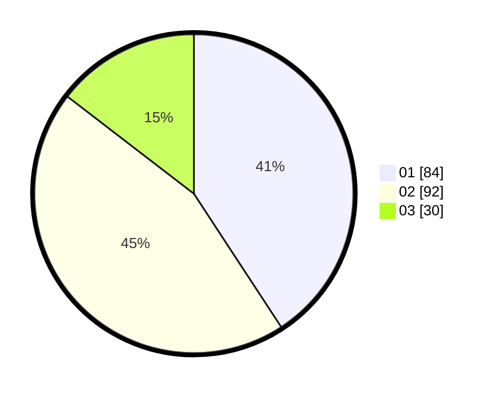

# Hasil

Hasil perolehan suara paslon dapat dilihat pada file paslon-01.txt, paslon-02.txt, dan paslon-03.txt.

Jika tidak ada, artinya data tersebut belum ada pada SIREKAP.

## Perolehan Suara

 * Paslon 01: **84**.
 * Paslon 02: **92**.
 * Paslon 03: **30**.

## Foto C Plano

https://sirekap-obj-formc.kpu.go.id/9ff0/pemilu/ppwp/31/74/01/10/06/3174011006033-20240216-125528--6d1a3758-2cff-4a8e-9a1d-765d35efaa22.jpg

https://sirekap-obj-formc.kpu.go.id/9ff0/pemilu/ppwp/31/74/01/10/06/3174011006033-20240216-125531--2f89cae4-6bf1-430f-89eb-3c21f580d3de.jpg

https://sirekap-obj-formc.kpu.go.id/9ff0/pemilu/ppwp/31/74/01/10/06/3174011006033-20240216-125529--10eedace-9ee2-411f-b502-7a56bfb742d5.jpg

## DATA PEMILIH TETAP

Jumlah pemilih dalam DPT: **253**.
 * L: **123**.
 * P: **130**.

## DATA PENGGUNA HAK PILIH

Jumlah pengguna hak pilih dalam DPT: **204**.
 * L: **95**.
 * P: **109**.

Jumlah pengguna hak pilih dalam DPTb: **1**.
 * L: **0**.
 * P: **1**.

Jumlah pengguna hak pilih dalam DPK: **1**.
 * L: **0**.
 * P: **1**.

Jumlah pengguna hak pilih: **206**.
 * L: **95**.
 * P: **111**.

## JUMLAH SUARA SAH DAN TIDAK SAH

JUMLAH SELURUH SUARA SAH: **206**.

JUMLAH SUARA TIDAK SAH: **0**.

JUMLAH SELURUH SUARA SAH DAN SUARA TIDAK SAH: **206**.
