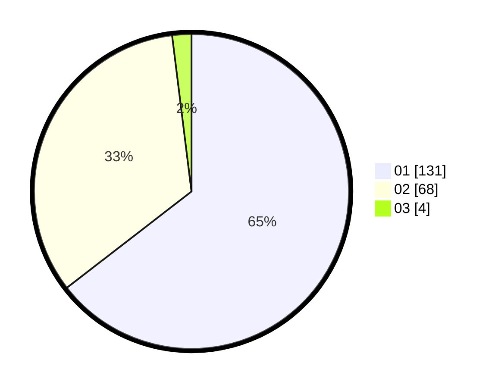

# Hasil

Hasil perolehan suara paslon dapat dilihat pada file paslon-01.txt, paslon-02.txt, dan paslon-03.txt.

Jika tidak ada, artinya data tersebut belum ada pada SIREKAP.

## Perolehan Suara

 * Paslon 01: **131**.
 * Paslon 02: **68**.
 * Paslon 03: **4**.

## Foto C Plano

https://sirekap-obj-formc.kpu.go.id/7dfa/pemilu/ppwp/31/74/01/10/06/3174011006035-20240215-162635--ef241911-6dd4-4582-bcee-d2ed418e1569.jpg

https://sirekap-obj-formc.kpu.go.id/7dfa/pemilu/ppwp/31/74/01/10/06/3174011006035-20240214-222924--9ad17566-6205-4d7f-8c04-0c47b579b1ad.jpg

https://sirekap-obj-formc.kpu.go.id/7dfa/pemilu/ppwp/31/74/01/10/06/3174011006035-20240215-163026--57da0895-5e6b-4a58-ae48-38f4bd1560d6.jpg
