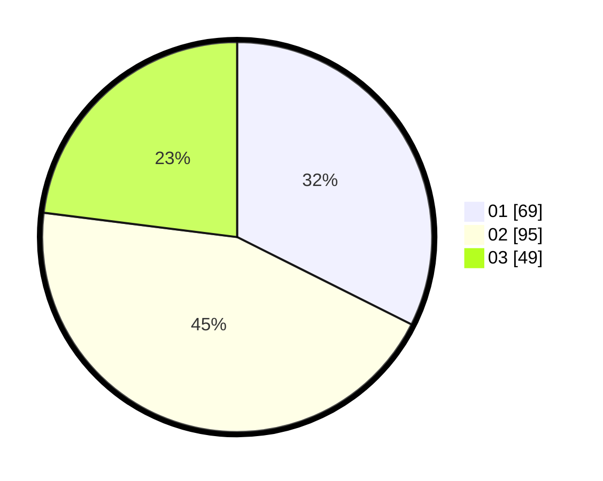

# Hasil

Hasil perolehan suara paslon dapat dilihat pada file paslon-01.txt, paslon-02.txt, dan paslon-03.txt.

Jika tidak ada, artinya data tersebut belum ada pada SIREKAP.

## Perolehan Suara

 * Paslon 01: **69**.
 * Paslon 02: **95**.
 * Paslon 03: **49**.

## Foto C Plano

https://sirekap-obj-formc.kpu.go.id/9fcf/pemilu/ppwp/31/74/01/10/06/3174011006056-20240216-023448--1d1bcb4d-446c-441e-84a5-c6ff5af12298.jpg

https://sirekap-obj-formc.kpu.go.id/9fcf/pemilu/ppwp/31/74/01/10/06/3174011006056-20240216-042109--7030a1be-356f-4091-8ad1-ae819daf95d5.jpg

https://sirekap-obj-formc.kpu.go.id/9fcf/pemilu/ppwp/31/74/01/10/06/3174011006056-20240216-023458--ee8e1a89-2094-4c0a-b6d8-674f8f7f3d4c.jpg

## DATA PEMILIH TETAP

Jumlah pemilih dalam DPT: **273**.
 * L: **142**.
 * P: **131**.

## DATA PENGGUNA HAK PILIH

Jumlah pengguna hak pilih dalam DPT: **212**.
 * L: **107**.
 * P: **105**.

Jumlah pengguna hak pilih dalam DPTb: **1**.
 * L: **0**.
 * P: **1**.

Jumlah pengguna hak pilih dalam DPK: **2**.
 * L: **1**.
 * P: **1**.

Jumlah pengguna hak pilih: **215**.
 * L: **108**.
 * P: **107**.

## JUMLAH SUARA SAH DAN TIDAK SAH

JUMLAH SELURUH SUARA SAH: **213**.

JUMLAH SUARA TIDAK SAH: **2**.

JUMLAH SELURUH SUARA SAH DAN SUARA TIDAK SAH: **215**.
