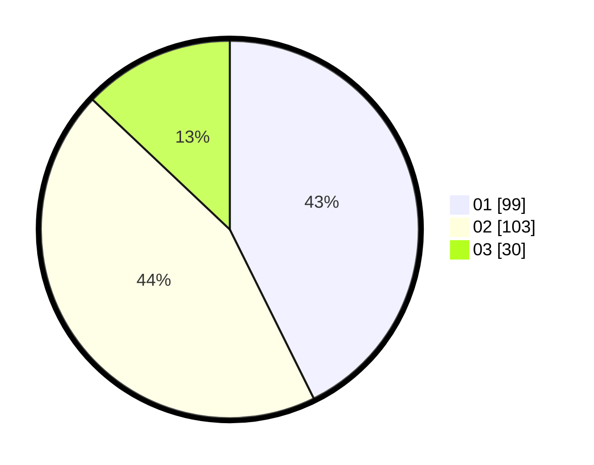

# Hasil

Hasil perolehan suara paslon dapat dilihat pada file paslon-01.txt, paslon-02.txt, dan paslon-03.txt.

Jika tidak ada, artinya data tersebut belum ada pada SIREKAP.

## Perolehan Suara

 * Paslon 01: **99**.
 * Paslon 02: **103**.
 * Paslon 03: **30**.

## Foto C Plano

https://sirekap-obj-formc.kpu.go.id/728d/pemilu/ppwp/31/74/01/10/06/3174011006059-20240214-234637--a359cb06-fec6-4a61-8471-ce2a6eba0c74.jpg

https://sirekap-obj-formc.kpu.go.id/728d/pemilu/ppwp/31/74/01/10/06/3174011006059-20240214-192103--3edd7650-961a-4aaa-b136-05bbb35e9c4a.jpg

https://sirekap-obj-formc.kpu.go.id/728d/pemilu/ppwp/31/74/01/10/06/3174011006059-20240214-192127--789f3daa-b736-4d10-aa76-93370e7536b5.jpg

## DATA PEMILIH TETAP

Jumlah pemilih dalam DPT: **267**.
 * L: **136**.
 * P: **131**.

## DATA PENGGUNA HAK PILIH

Jumlah pengguna hak pilih dalam DPT: **225**.
 * L: **109**.
 * P: **116**.

Jumlah pengguna hak pilih dalam DPTb: **1**.
 * L: **0**.
 * P: **1**.

Jumlah pengguna hak pilih dalam DPK: **9**.
 * L: **3**.
 * P: **6**.

Jumlah pengguna hak pilih: **235**.
 * L: **112**.
 * P: **123**.

## JUMLAH SUARA SAH DAN TIDAK SAH

JUMLAH SELURUH SUARA SAH: **232**.

JUMLAH SUARA TIDAK SAH: **3**.

JUMLAH SELURUH SUARA SAH DAN SUARA TIDAK SAH: **235**.
