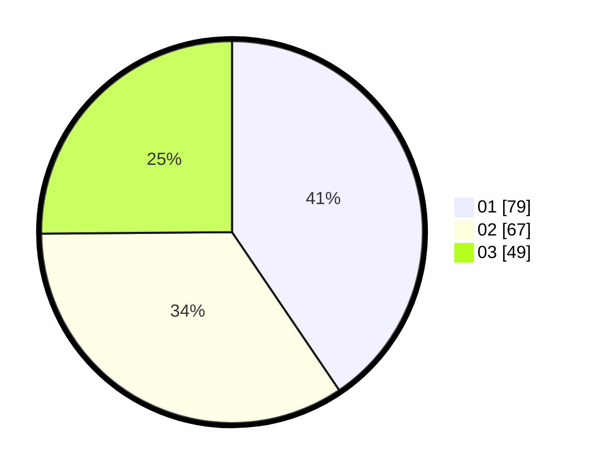

# Hasil

Hasil perolehan suara paslon dapat dilihat pada file paslon-01.txt, paslon-02.txt, dan paslon-03.txt.

Jika tidak ada, artinya data tersebut belum ada pada SIREKAP.

## Perolehan Suara

 * Paslon 01: **79**.
 * Paslon 02: **67**.
 * Paslon 03: **49**.

## Foto C Plano

https://sirekap-obj-formc.kpu.go.id/6761/pemilu/ppwp/31/74/01/10/07/3174011007004-20240214-201426--aba4fd96-7d7d-4664-989a-b425b2767118.jpg

https://sirekap-obj-formc.kpu.go.id/6761/pemilu/ppwp/31/74/01/10/07/3174011007004-20240214-201941--8ec0af0c-f4c3-4276-91e2-f2cddd1a3352.jpg

https://sirekap-obj-formc.kpu.go.id/6761/pemilu/ppwp/31/74/01/10/07/3174011007004-20240214-212558--a9f67d99-f7b6-4eac-9861-55c3e4d8afac.jpg

## DATA PEMILIH TETAP

Jumlah pemilih dalam DPT: **273**.
 * L: **134**.
 * P: **139**.

## DATA PENGGUNA HAK PILIH

Jumlah pengguna hak pilih dalam DPT: **212**.
 * L: **102**.
 * P: **110**.

Jumlah pengguna hak pilih dalam DPTb: **2**.
 * L: **1**.
 * P: **1**.

Jumlah pengguna hak pilih dalam DPK: **0**.
 * L: **0**.
 * P: **0**.

Jumlah pengguna hak pilih: **214**.
 * L: **103**.
 * P: **111**.

## JUMLAH SUARA SAH DAN TIDAK SAH

JUMLAH SELURUH SUARA SAH: **195**.

JUMLAH SUARA TIDAK SAH: **17**.

JUMLAH SELURUH SUARA SAH DAN SUARA TIDAK SAH: **212**.
