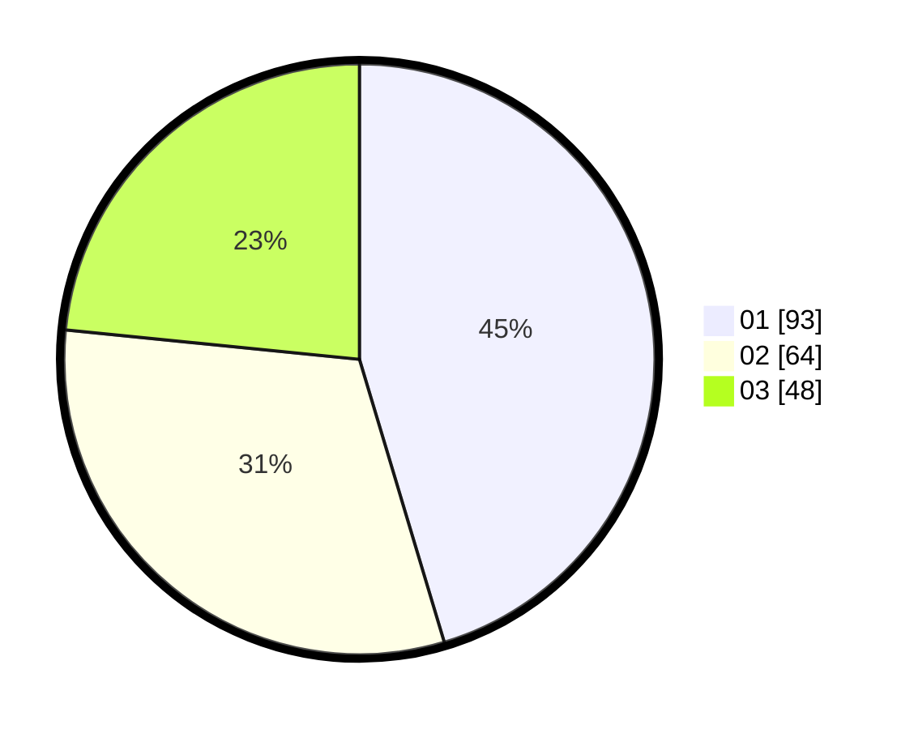

# Hasil

Hasil perolehan suara paslon dapat dilihat pada file paslon-01.txt, paslon-02.txt, dan paslon-03.txt.

Jika tidak ada, artinya data tersebut belum ada pada SIREKAP.

## Perolehan Suara

 * Paslon 01: **93**.
 * Paslon 02: **64**.
 * Paslon 03: **48**.

## Foto C Plano

https://sirekap-obj-formc.kpu.go.id/d578/pemilu/ppwp/31/74/01/10/07/3174011007005-20240218-150041--6f0326a0-eaa9-4481-baed-b01950531109.jpg

https://sirekap-obj-formc.kpu.go.id/d578/pemilu/ppwp/31/74/01/10/07/3174011007005-20240218-145724--c9dd2f0d-1dab-4c8b-a710-02ac10654f1a.jpg

https://sirekap-obj-formc.kpu.go.id/d578/pemilu/ppwp/31/74/01/10/07/3174011007005-20240218-164508--6fb9d121-18d6-4de0-9733-e73cb20a6ebe.jpg

## DATA PEMILIH TETAP

Jumlah pemilih dalam DPT: **271**.
 * L: **139**.
 * P: **132**.

## DATA PENGGUNA HAK PILIH

Jumlah pengguna hak pilih dalam DPT: **202**.
 * L: **98**.
 * P: **104**.

Jumlah pengguna hak pilih dalam DPTb: **1**.
 * L: **1**.
 * P: **0**.

Jumlah pengguna hak pilih dalam DPK: **4**.
 * L: **3**.
 * P: **1**.

Jumlah pengguna hak pilih: **207**.
 * L: **102**.
 * P: **105**.

## JUMLAH SUARA SAH DAN TIDAK SAH

JUMLAH SELURUH SUARA SAH: **205**.

JUMLAH SUARA TIDAK SAH: **2**.

JUMLAH SELURUH SUARA SAH DAN SUARA TIDAK SAH: **207**.
