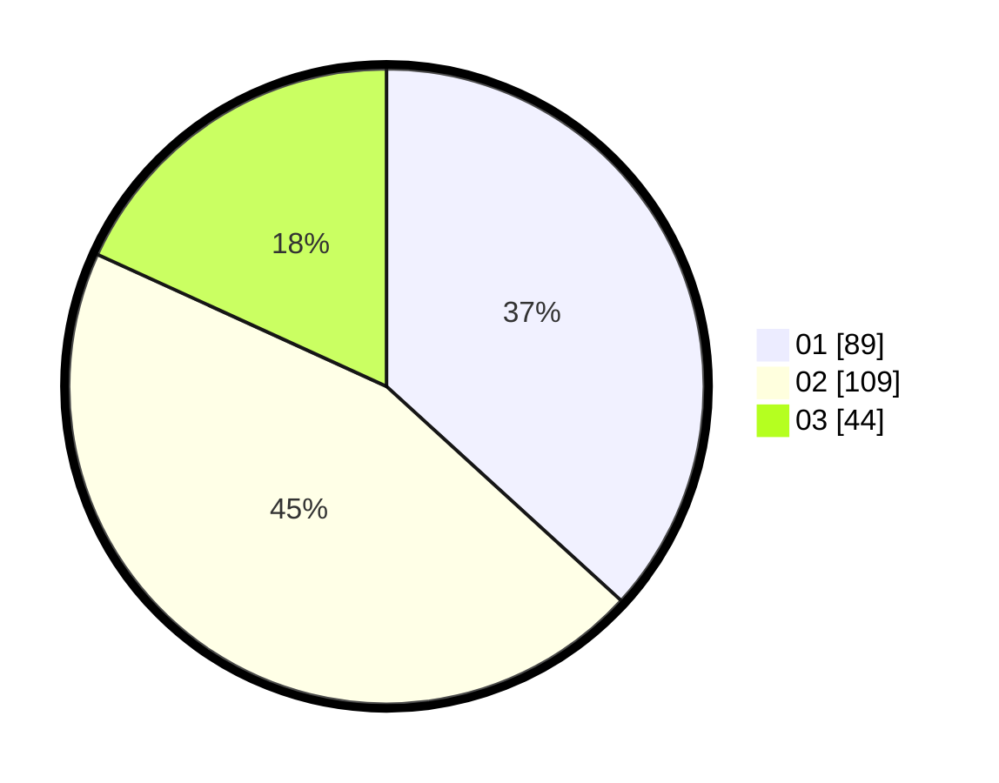

# Hasil

Hasil perolehan suara paslon dapat dilihat pada file paslon-01.txt, paslon-02.txt, dan paslon-03.txt.

Jika tidak ada, artinya data tersebut belum ada pada SIREKAP.

## Perolehan Suara

 * Paslon 01: **89**.
 * Paslon 02: **109**.
 * Paslon 03: **44**.

## Foto C Plano

https://sirekap-obj-formc.kpu.go.id/6169/pemilu/ppwp/31/74/01/10/07/3174011007013-20240214-191007--58e4d630-405b-4636-889b-fda0cb9cf676.jpg

https://sirekap-obj-formc.kpu.go.id/6169/pemilu/ppwp/31/74/01/10/07/3174011007013-20240214-191859--ea81cff4-aed4-4d2d-b930-94b32d80649b.jpg

https://sirekap-obj-formc.kpu.go.id/6169/pemilu/ppwp/31/74/01/10/07/3174011007013-20240214-192245--e2f79349-8735-4407-bf04-10d83c8f1b4d.jpg

## DATA PEMILIH TETAP

Jumlah pemilih dalam DPT: **271**.
 * L: **128**.
 * P: **143**.

## DATA PENGGUNA HAK PILIH

Jumlah pengguna hak pilih dalam DPT: **238**.
 * L: **111**.
 * P: **127**.

Jumlah pengguna hak pilih dalam DPTb: **4**.
 * L: **0**.
 * P: **4**.

Jumlah pengguna hak pilih dalam DPK: **2**.
 * L: **1**.
 * P: **1**.

Jumlah pengguna hak pilih: **244**.
 * L: **112**.
 * P: **132**.

## JUMLAH SUARA SAH DAN TIDAK SAH

JUMLAH SELURUH SUARA SAH: **242**.

JUMLAH SUARA TIDAK SAH: **2**.

JUMLAH SELURUH SUARA SAH DAN SUARA TIDAK SAH: **244**.
