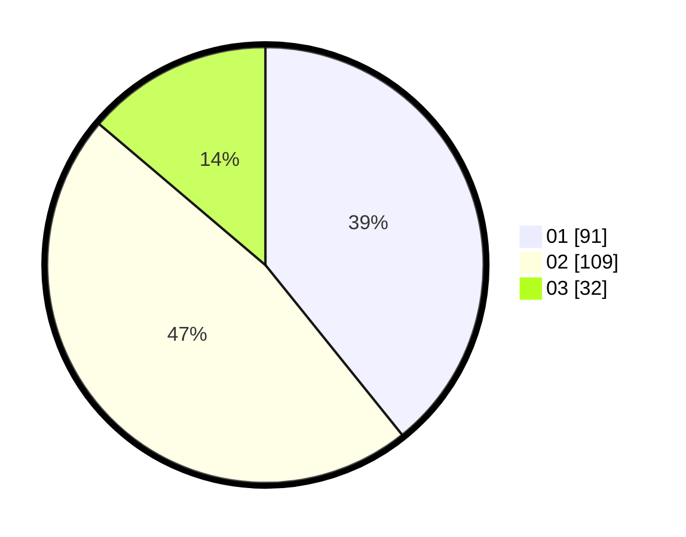

# Hasil

Hasil perolehan suara paslon dapat dilihat pada file paslon-01.txt, paslon-02.txt, dan paslon-03.txt.

Jika tidak ada, artinya data tersebut belum ada pada SIREKAP.

## Perolehan Suara

 * Paslon 01: **91**.
 * Paslon 02: **109**.
 * Paslon 03: **32**.

## Foto C Plano

https://sirekap-obj-formc.kpu.go.id/8a9a/pemilu/ppwp/31/74/01/10/07/3174011007018-20240214-192429--a2d7c3d6-5750-4461-b0fc-44a621412586.jpg

https://sirekap-obj-formc.kpu.go.id/8a9a/pemilu/ppwp/31/74/01/10/07/3174011007018-20240214-194134--6ddd9da7-e10a-4b92-8878-a3f0d2ca1461.jpg

https://sirekap-obj-formc.kpu.go.id/8a9a/pemilu/ppwp/31/74/01/10/07/3174011007018-20240214-194433--7c71ccb5-a350-426f-bfb9-dc1c47eec071.jpg

## DATA PEMILIH TETAP

Jumlah pemilih dalam DPT: **282**.
 * L: **146**.
 * P: **136**.

## DATA PENGGUNA HAK PILIH

Jumlah pengguna hak pilih dalam DPT: **236**.
 * L: **126**.
 * P: **110**.

Jumlah pengguna hak pilih dalam DPTb: **0**.
 * L: **0**.
 * P: **0**.

Jumlah pengguna hak pilih dalam DPK: **1**.
 * L: **1**.
 * P: **0**.

Jumlah pengguna hak pilih: **237**.
 * L: **127**.
 * P: **110**.

## JUMLAH SUARA SAH DAN TIDAK SAH

JUMLAH SELURUH SUARA SAH: **232**.

JUMLAH SUARA TIDAK SAH: **5**.

JUMLAH SELURUH SUARA SAH DAN SUARA TIDAK SAH: **237**.
