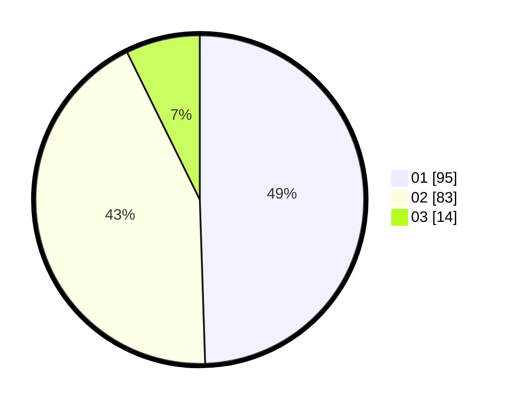

# Hasil

Hasil perolehan suara paslon dapat dilihat pada file paslon-01.txt, paslon-02.txt, dan paslon-03.txt.

Jika tidak ada, artinya data tersebut belum ada pada SIREKAP.

## Perolehan Suara

 * Paslon 01: **95**.
 * Paslon 02: **83**.
 * Paslon 03: **14**.

## Foto C Plano

https://sirekap-obj-formc.kpu.go.id/1f9a/pemilu/ppwp/31/74/01/10/07/3174011007036-20240218-182832--8bbae6eb-9664-4bf1-b8ef-6903d2fe3278.jpg

https://sirekap-obj-formc.kpu.go.id/1f9a/pemilu/ppwp/31/74/01/10/07/3174011007036-20240218-182834--91f32932-9d40-4e91-a8d5-a70ae0a0d4dc.jpg

https://sirekap-obj-formc.kpu.go.id/1f9a/pemilu/ppwp/31/74/01/10/07/3174011007036-20240218-182833--d2ef5d1c-2844-40d9-b446-e7c5e6a5e03b.jpg

## DATA PEMILIH TETAP

Jumlah pemilih dalam DPT: **262**.
 * L: **134**.
 * P: **128**.

## DATA PENGGUNA HAK PILIH

Jumlah pengguna hak pilih dalam DPT: **197**.
 * L: **96**.
 * P: **101**.

Jumlah pengguna hak pilih dalam DPTb: **0**.
 * L: **0**.
 * P: **0**.

Jumlah pengguna hak pilih dalam DPK: **0**.
 * L: **0**.
 * P: **0**.

Jumlah pengguna hak pilih: **197**.
 * L: **96**.
 * P: **101**.

## JUMLAH SUARA SAH DAN TIDAK SAH

JUMLAH SELURUH SUARA SAH: **191**.

JUMLAH SUARA TIDAK SAH: **5**.

JUMLAH SELURUH SUARA SAH DAN SUARA TIDAK SAH: **196**.
