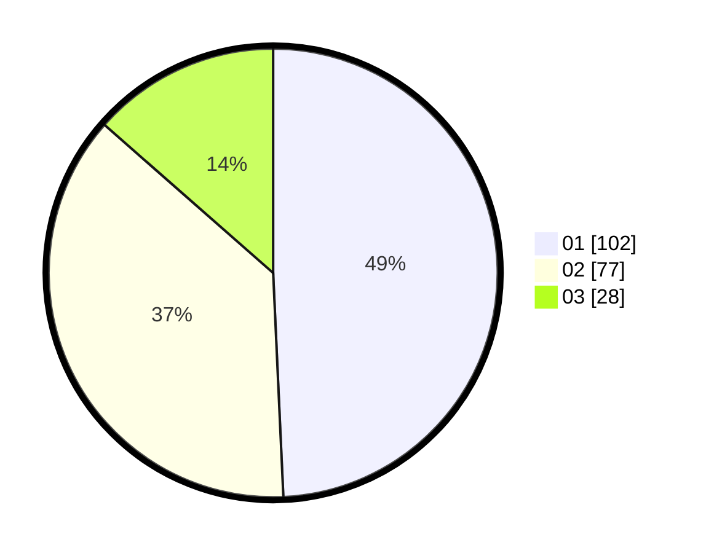

# Hasil

Hasil perolehan suara paslon dapat dilihat pada file paslon-01.txt, paslon-02.txt, dan paslon-03.txt.

Jika tidak ada, artinya data tersebut belum ada pada SIREKAP.

## Perolehan Suara

 * Paslon 01: **102**.
 * Paslon 02: **77**.
 * Paslon 03: **28**.

## Foto C Plano

https://sirekap-obj-formc.kpu.go.id/b33b/pemilu/ppwp/31/74/01/10/07/3174011007039-20240214-221316--0b17d20f-7e14-4ef3-b52d-c81f7b6a3261.jpg

https://sirekap-obj-formc.kpu.go.id/b33b/pemilu/ppwp/31/74/01/10/07/3174011007039-20240214-221424--62785655-87bc-4213-8dea-5b7988ec8522.jpg

https://sirekap-obj-formc.kpu.go.id/b33b/pemilu/ppwp/31/74/01/10/07/3174011007039-20240214-221510--548bd8ac-7fbf-40b8-8db1-ca1c64940010.jpg

## DATA PEMILIH TETAP

Jumlah pemilih dalam DPT: **257**.
 * L: **129**.
 * P: **128**.

## DATA PENGGUNA HAK PILIH

Jumlah pengguna hak pilih dalam DPT: **204**.
 * L: **103**.
 * P: **101**.

Jumlah pengguna hak pilih dalam DPTb: **3**.
 * L: **2**.
 * P: **1**.

Jumlah pengguna hak pilih dalam DPK: **3**.
 * L: **0**.
 * P: **3**.

Jumlah pengguna hak pilih: **210**.
 * L: **105**.
 * P: **105**.

## JUMLAH SUARA SAH DAN TIDAK SAH

JUMLAH SELURUH SUARA SAH: **207**.

JUMLAH SUARA TIDAK SAH: **3**.

JUMLAH SELURUH SUARA SAH DAN SUARA TIDAK SAH: **210**.
