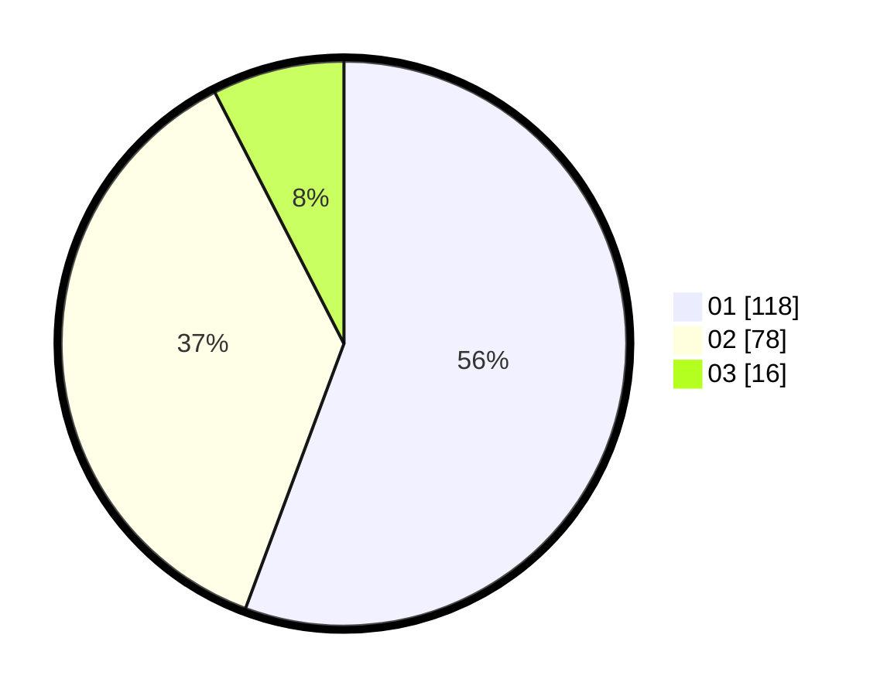

# Hasil

Hasil perolehan suara paslon dapat dilihat pada file paslon-01.txt, paslon-02.txt, dan paslon-03.txt.

Jika tidak ada, artinya data tersebut belum ada pada SIREKAP.

## Perolehan Suara

 * Paslon 01: **118**.
 * Paslon 02: **78**.
 * Paslon 03: **16**.

## Foto C Plano

https://sirekap-obj-formc.kpu.go.id/7180/pemilu/ppwp/31/74/01/10/07/3174011007041-20240214-160154--74e7eb43-6abc-4656-9078-ad35199bd3ba.jpg

https://sirekap-obj-formc.kpu.go.id/7180/pemilu/ppwp/31/74/01/10/07/3174011007041-20240215-231728--c1fa3758-f25a-4908-99cf-cb93984225b8.jpg

https://sirekap-obj-formc.kpu.go.id/7180/pemilu/ppwp/31/74/01/10/07/3174011007041-20240215-231726--23823ea2-4f55-489a-8547-439c45004827.jpg

## DATA PEMILIH TETAP

Jumlah pemilih dalam DPT: **258**.
 * L: **123**.
 * P: **135**.

## DATA PENGGUNA HAK PILIH

Jumlah pengguna hak pilih dalam DPT: **215**.
 * L: **98**.
 * P: **117**.

Jumlah pengguna hak pilih dalam DPTb: **0**.
 * L: **0**.
 * P: **0**.

Jumlah pengguna hak pilih dalam DPK: **2**.
 * L: **2**.
 * P: **0**.

Jumlah pengguna hak pilih: **217**.
 * L: **100**.
 * P: **117**.

## JUMLAH SUARA SAH DAN TIDAK SAH

JUMLAH SELURUH SUARA SAH: **212**.

JUMLAH SUARA TIDAK SAH: **5**.

JUMLAH SELURUH SUARA SAH DAN SUARA TIDAK SAH: **217**.
