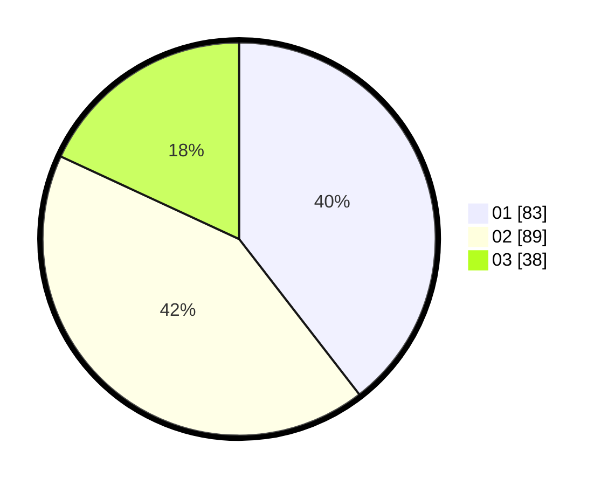

# Hasil

Hasil perolehan suara paslon dapat dilihat pada file paslon-01.txt, paslon-02.txt, dan paslon-03.txt.

Jika tidak ada, artinya data tersebut belum ada pada SIREKAP.

## Perolehan Suara

 * Paslon 01: **83**.
 * Paslon 02: **89**.
 * Paslon 03: **38**.

## Foto C Plano

https://sirekap-obj-formc.kpu.go.id/92f7/pemilu/ppwp/31/74/01/10/07/3174011007044-20240214-203111--e1fb796d-09eb-421f-ae50-0488d43c1715.jpg

https://sirekap-obj-formc.kpu.go.id/92f7/pemilu/ppwp/31/74/01/10/07/3174011007044-20240214-203207--65c76656-e5f8-49be-a668-b260c79d47b4.jpg

https://sirekap-obj-formc.kpu.go.id/92f7/pemilu/ppwp/31/74/01/10/07/3174011007044-20240214-203254--fe4b1833-71e3-4def-a66b-0cbb3c310065.jpg

## DATA PEMILIH TETAP

Jumlah pemilih dalam DPT: **265**.
 * L: **135**.
 * P: **130**.

## DATA PENGGUNA HAK PILIH

Jumlah pengguna hak pilih dalam DPT: **211**.
 * L: **103**.
 * P: **108**.

Jumlah pengguna hak pilih dalam DPTb: **0**.
 * L: **0**.
 * P: **0**.

Jumlah pengguna hak pilih dalam DPK: **1**.
 * L: **0**.
 * P: **1**.

Jumlah pengguna hak pilih: **212**.
 * L: **103**.
 * P: **109**.

## JUMLAH SUARA SAH DAN TIDAK SAH

JUMLAH SELURUH SUARA SAH: **210**.

JUMLAH SUARA TIDAK SAH: **2**.

JUMLAH SELURUH SUARA SAH DAN SUARA TIDAK SAH: **212**.
