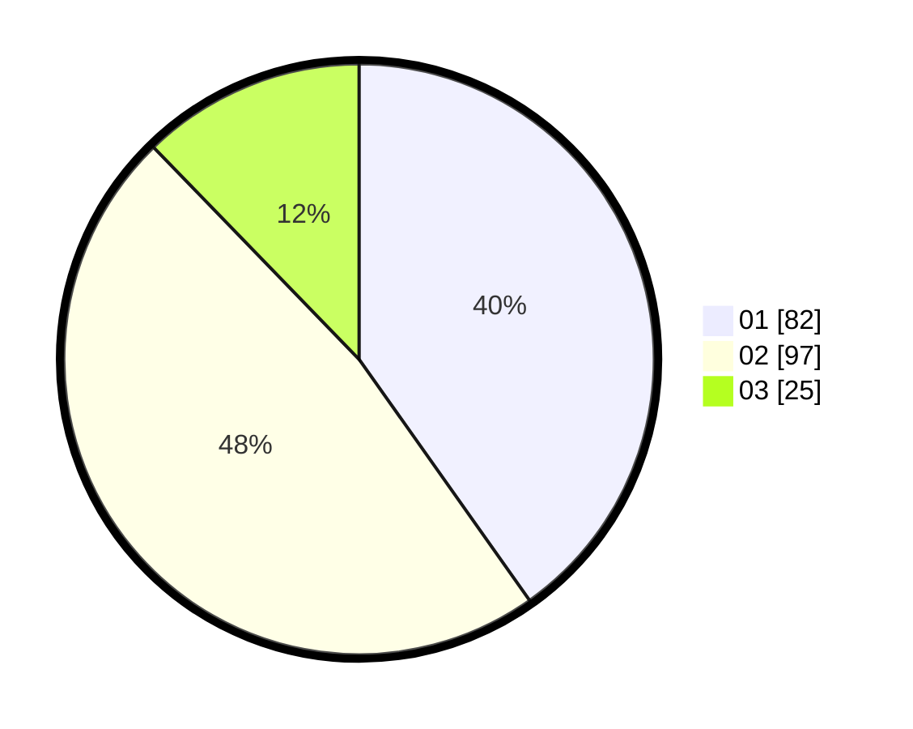

# Hasil

Hasil perolehan suara paslon dapat dilihat pada file paslon-01.txt, paslon-02.txt, dan paslon-03.txt.

Jika tidak ada, artinya data tersebut belum ada pada SIREKAP.

## Perolehan Suara

 * Paslon 01: **82**.
 * Paslon 02: **97**.
 * Paslon 03: **25**.

## Foto C Plano

https://sirekap-obj-formc.kpu.go.id/d1fe/pemilu/ppwp/31/74/01/10/07/3174011007048-20240216-194857--28c369f0-f171-4fa8-8b61-81f478cabc79.jpg

https://sirekap-obj-formc.kpu.go.id/d1fe/pemilu/ppwp/31/74/01/10/07/3174011007048-20240218-163232--a645eb6e-4770-4278-8e68-c4604b8684eb.jpg

https://sirekap-obj-formc.kpu.go.id/d1fe/pemilu/ppwp/31/74/01/10/07/3174011007048-20240216-201849--1b52f880-9a4b-4709-bf5b-b7f26513f478.jpg

## DATA PEMILIH TETAP

Jumlah pemilih dalam DPT: **270**.
 * L: **131**.
 * P: **139**.

## DATA PENGGUNA HAK PILIH

Jumlah pengguna hak pilih dalam DPT: **204**.
 * L: **100**.
 * P: **104**.

Jumlah pengguna hak pilih dalam DPTb: **0**.
 * L: **0**.
 * P: **0**.

Jumlah pengguna hak pilih dalam DPK: **1**.
 * L: **0**.
 * P: **1**.

Jumlah pengguna hak pilih: **205**.
 * L: **100**.
 * P: **105**.

## JUMLAH SUARA SAH DAN TIDAK SAH

JUMLAH SELURUH SUARA SAH: **204**.

JUMLAH SUARA TIDAK SAH: **1**.

JUMLAH SELURUH SUARA SAH DAN SUARA TIDAK SAH: **205**.
