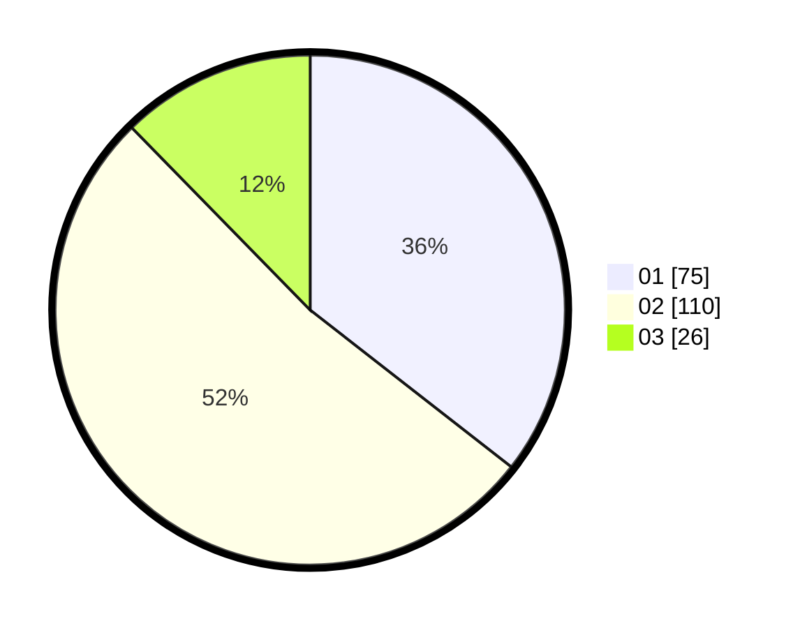

# Hasil

Hasil perolehan suara paslon dapat dilihat pada file paslon-01.txt, paslon-02.txt, dan paslon-03.txt.

Jika tidak ada, artinya data tersebut belum ada pada SIREKAP.

## Perolehan Suara

 * Paslon 01: **75**.
 * Paslon 02: **110**.
 * Paslon 03: **26**.

## Foto C Plano

https://sirekap-obj-formc.kpu.go.id/10ab/pemilu/ppwp/31/74/01/10/07/3174011007049-20240217-153446--11631bf8-760e-4bb7-9dc9-34e02031da6f.jpg

https://sirekap-obj-formc.kpu.go.id/10ab/pemilu/ppwp/31/74/01/10/07/3174011007049-20240214-155031--087cb8e5-a05c-4a6b-823e-9be7c68beaef.jpg

https://sirekap-obj-formc.kpu.go.id/10ab/pemilu/ppwp/31/74/01/10/07/3174011007049-20240214-200746--71e5ef31-a6b6-4ca5-91f6-29e77d6a2c39.jpg

## DATA PEMILIH TETAP

Jumlah pemilih dalam DPT: **259**.
 * L: **123**.
 * P: **136**.

## DATA PENGGUNA HAK PILIH

Jumlah pengguna hak pilih dalam DPT: **208**.
 * L: **97**.
 * P: **111**.

Jumlah pengguna hak pilih dalam DPTb: **0**.
 * L: **0**.
 * P: **0**.

Jumlah pengguna hak pilih dalam DPK: **10**.
 * L: **6**.
 * P: **4**.

Jumlah pengguna hak pilih: **218**.
 * L: **103**.
 * P: **115**.

## JUMLAH SUARA SAH DAN TIDAK SAH

JUMLAH SELURUH SUARA SAH: **211**.

JUMLAH SUARA TIDAK SAH: **7**.

JUMLAH SELURUH SUARA SAH DAN SUARA TIDAK SAH: **218**.
