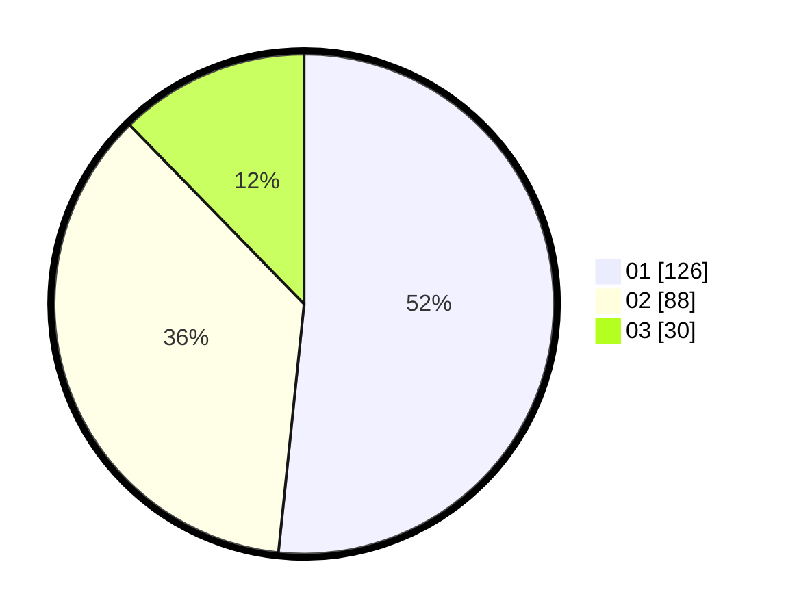

# Hasil

Hasil perolehan suara paslon dapat dilihat pada file paslon-01.txt, paslon-02.txt, dan paslon-03.txt.

Jika tidak ada, artinya data tersebut belum ada pada SIREKAP.

## Perolehan Suara

 * Paslon 01: **126**.
 * Paslon 02: **88**.
 * Paslon 03: **30**.

## Foto C Plano

https://sirekap-obj-formc.kpu.go.id/a32f/pemilu/ppwp/31/74/01/10/07/3174011007050-20240216-150317--fa6b5ac9-164f-4bf7-b906-dae02981f442.jpg

https://sirekap-obj-formc.kpu.go.id/a32f/pemilu/ppwp/31/74/01/10/07/3174011007050-20240217-171903--b534e4c0-7837-463c-8410-7b2b5eaba3f2.jpg

https://sirekap-obj-formc.kpu.go.id/a32f/pemilu/ppwp/31/74/01/10/07/3174011007050-20240217-172201--8867e161-e010-4b32-88bd-25ad8ee7cc76.jpg

## DATA PEMILIH TETAP

Jumlah pemilih dalam DPT: **283**.
 * L: **140**.
 * P: **143**.

## DATA PENGGUNA HAK PILIH

Jumlah pengguna hak pilih dalam DPT: **248**.
 * L: **119**.
 * P: **129**.

Jumlah pengguna hak pilih dalam DPTb: **2**.
 * L: **2**.
 * P: **0**.

Jumlah pengguna hak pilih dalam DPK: **0**.
 * L: **0**.
 * P: **0**.

Jumlah pengguna hak pilih: **250**.
 * L: **121**.
 * P: **129**.

## JUMLAH SUARA SAH DAN TIDAK SAH

JUMLAH SELURUH SUARA SAH: **244**.

JUMLAH SUARA TIDAK SAH: **6**.

JUMLAH SELURUH SUARA SAH DAN SUARA TIDAK SAH: **250**.
