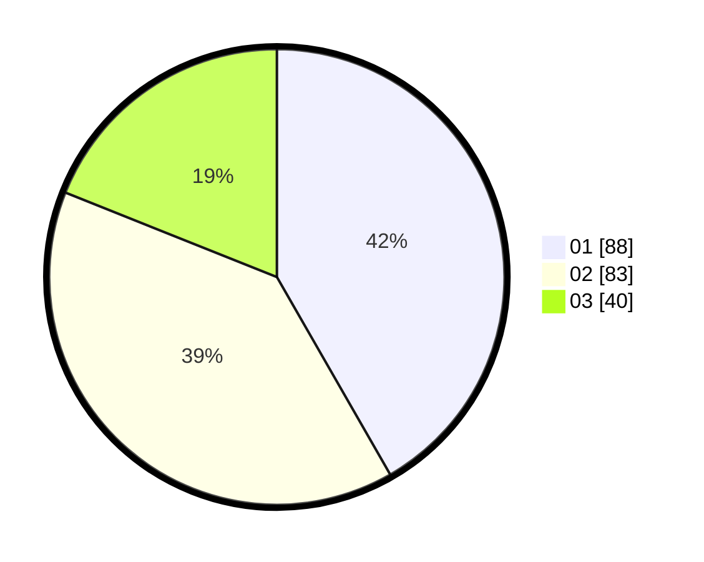

# Hasil

Hasil perolehan suara paslon dapat dilihat pada file paslon-01.txt, paslon-02.txt, dan paslon-03.txt.

Jika tidak ada, artinya data tersebut belum ada pada SIREKAP.

## Perolehan Suara

 * Paslon 01: **88**.
 * Paslon 02: **83**.
 * Paslon 03: **40**.

## Foto C Plano

https://sirekap-obj-formc.kpu.go.id/937c/pemilu/ppwp/31/74/01/10/07/3174011007056-20240214-195223--50589bfa-42c1-4c73-8c61-3ce0d7ad3680.jpg

https://sirekap-obj-formc.kpu.go.id/937c/pemilu/ppwp/31/74/01/10/07/3174011007056-20240214-193450--cd2364de-e41d-47ba-91e6-cb49ad7684dd.jpg

https://sirekap-obj-formc.kpu.go.id/937c/pemilu/ppwp/31/74/01/10/07/3174011007056-20240214-193812--3746bf02-cf99-458d-88c2-ca3d9812c419.jpg

## DATA PEMILIH TETAP

Jumlah pemilih dalam DPT: **252**.
 * L: **111**.
 * P: **141**.

## DATA PENGGUNA HAK PILIH

Jumlah pengguna hak pilih dalam DPT: **214**.
 * L: **94**.
 * P: **120**.

Jumlah pengguna hak pilih dalam DPTb: **0**.
 * L: **0**.
 * P: **0**.

Jumlah pengguna hak pilih dalam DPK: **0**.
 * L: **0**.
 * P: **0**.

Jumlah pengguna hak pilih: **214**.
 * L: **94**.
 * P: **120**.

## JUMLAH SUARA SAH DAN TIDAK SAH

JUMLAH SELURUH SUARA SAH: **211**.

JUMLAH SUARA TIDAK SAH: **3**.

JUMLAH SELURUH SUARA SAH DAN SUARA TIDAK SAH: **214**.
