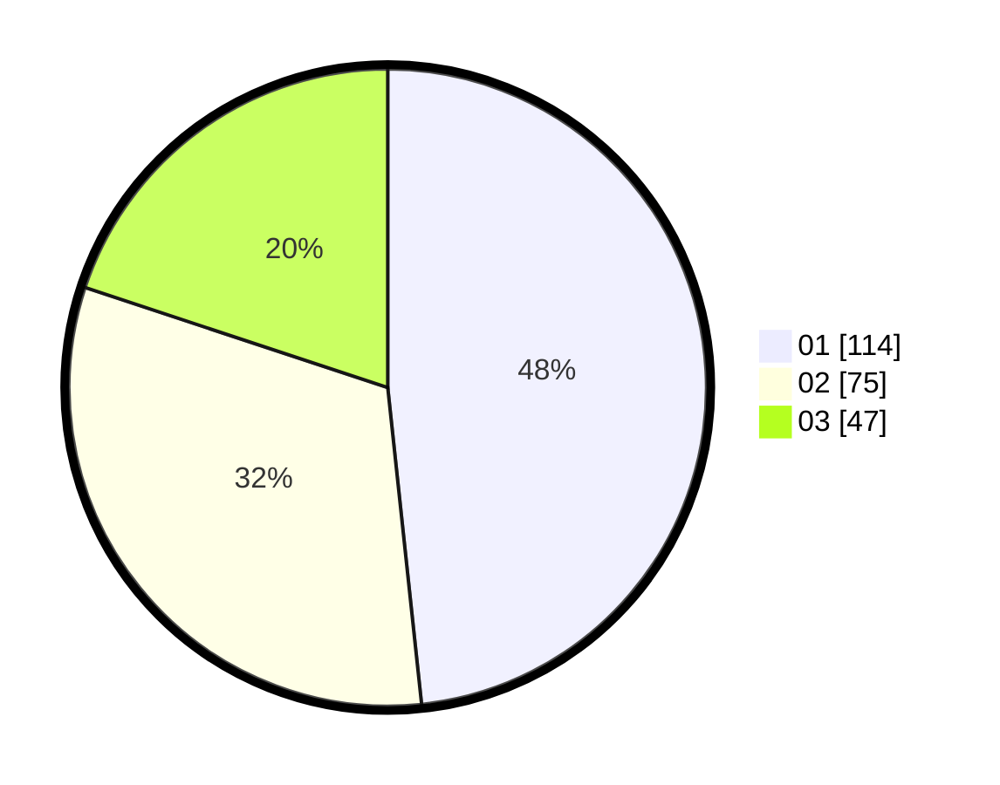

# Hasil

Hasil perolehan suara paslon dapat dilihat pada file paslon-01.txt, paslon-02.txt, dan paslon-03.txt.

Jika tidak ada, artinya data tersebut belum ada pada SIREKAP.

## Perolehan Suara

 * Paslon 01: **114**.
 * Paslon 02: **75**.
 * Paslon 03: **47**.

## Foto C Plano

https://sirekap-obj-formc.kpu.go.id/ff16/pemilu/ppwp/31/74/01/10/07/3174011007061-20240218-161839--f02143b0-8911-45ef-a366-6e39b23ac1cc.jpg

https://sirekap-obj-formc.kpu.go.id/ff16/pemilu/ppwp/31/74/01/10/07/3174011007061-20240218-163040--b52cf9eb-ab40-400a-a2dc-649212ff95a3.jpg

https://sirekap-obj-formc.kpu.go.id/ff16/pemilu/ppwp/31/74/01/10/07/3174011007061-20240218-163307--d9b888bb-723f-4fce-9666-223a54944f0c.jpg

## DATA PEMILIH TETAP

Jumlah pemilih dalam DPT: **274**.
 * L: **130**.
 * P: **144**.

## DATA PENGGUNA HAK PILIH

Jumlah pengguna hak pilih dalam DPT: **231**.
 * L: **104**.
 * P: **127**.

Jumlah pengguna hak pilih dalam DPTb: **7**.
 * L: **4**.
 * P: **3**.

Jumlah pengguna hak pilih dalam DPK: **0**.
 * L: **0**.
 * P: **0**.

Jumlah pengguna hak pilih: **238**.
 * L: **108**.
 * P: **130**.

## JUMLAH SUARA SAH DAN TIDAK SAH

JUMLAH SELURUH SUARA SAH: **236**.

JUMLAH SUARA TIDAK SAH: **2**.

JUMLAH SELURUH SUARA SAH DAN SUARA TIDAK SAH: **238**.
