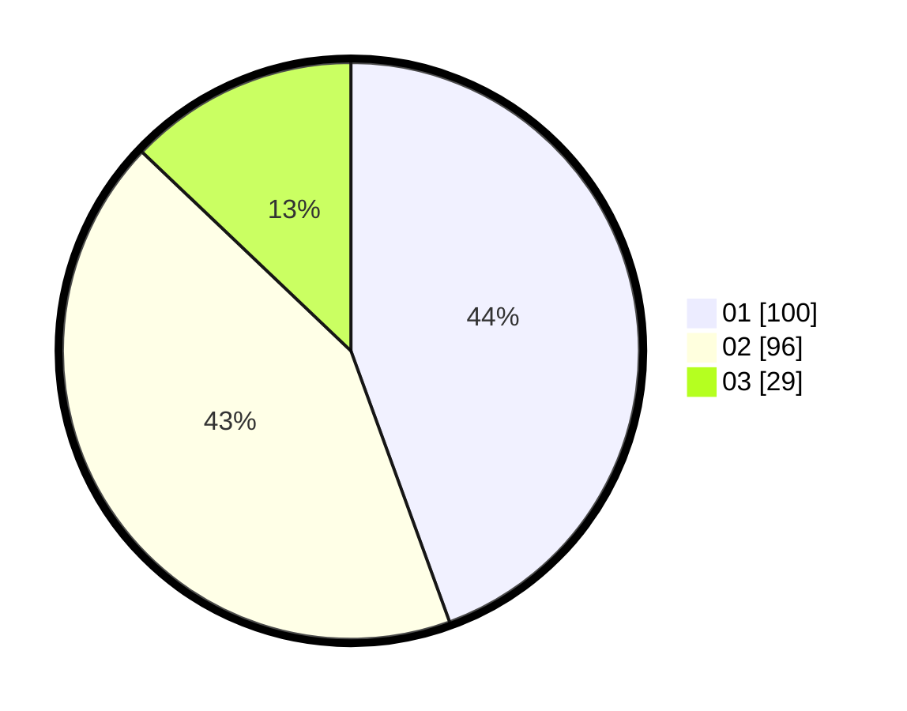

# Hasil

Hasil perolehan suara paslon dapat dilihat pada file paslon-01.txt, paslon-02.txt, dan paslon-03.txt.

Jika tidak ada, artinya data tersebut belum ada pada SIREKAP.

## Perolehan Suara

 * Paslon 01: **100**.
 * Paslon 02: **96**.
 * Paslon 03: **29**.

## Foto C Plano

https://sirekap-obj-formc.kpu.go.id/ebb0/pemilu/ppwp/31/74/01/10/07/3174011007067-20240216-150956--070ac59a-1bff-4ebb-a0c0-fa27f717be2d.jpg

https://sirekap-obj-formc.kpu.go.id/ebb0/pemilu/ppwp/31/74/01/10/07/3174011007067-20240216-151354--ddaddf11-5a60-489e-8b13-4dd5dfe6524b.jpg

https://sirekap-obj-formc.kpu.go.id/ebb0/pemilu/ppwp/31/74/01/10/07/3174011007067-20240216-155713--7a1f1b51-f119-48e0-b550-4a8aa1f4e550.jpg

## DATA PEMILIH TETAP

Jumlah pemilih dalam DPT: **232**.
 * L: **145**.
 * P: **137**.

## DATA PENGGUNA HAK PILIH

Jumlah pengguna hak pilih dalam DPT: **227**.
 * L: **115**.
 * P: **112**.

Jumlah pengguna hak pilih dalam DPTb: **2**.
 * L: **2**.
 * P: **0**.

Jumlah pengguna hak pilih dalam DPK: **3**.
 * L: **1**.
 * P: **2**.

Jumlah pengguna hak pilih: **232**.
 * L: **118**.
 * P: **114**.

## JUMLAH SUARA SAH DAN TIDAK SAH

JUMLAH SELURUH SUARA SAH: **225**.

JUMLAH SUARA TIDAK SAH: **7**.

JUMLAH SELURUH SUARA SAH DAN SUARA TIDAK SAH: **232**.
