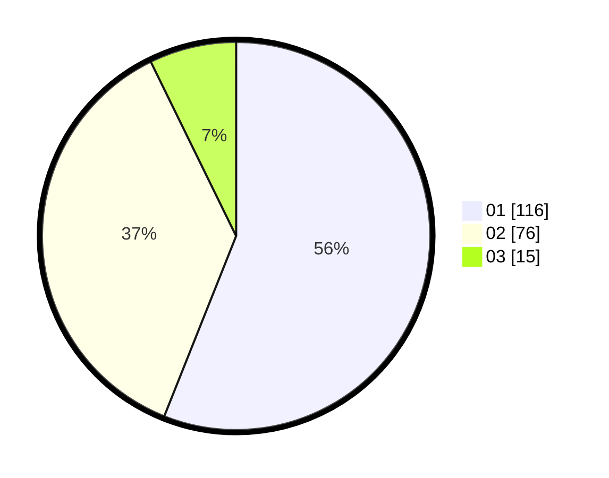

# Hasil

Hasil perolehan suara paslon dapat dilihat pada file paslon-01.txt, paslon-02.txt, dan paslon-03.txt.

Jika tidak ada, artinya data tersebut belum ada pada SIREKAP.

## Perolehan Suara

 * Paslon 01: **116**.
 * Paslon 02: **76**.
 * Paslon 03: **15**.

## Foto C Plano

https://sirekap-obj-formc.kpu.go.id/cbbf/pemilu/ppwp/31/74/01/10/07/3174011007068-20240214-192104--04459092-1592-4c37-8f26-730b0bdb99ed.jpg

https://sirekap-obj-formc.kpu.go.id/cbbf/pemilu/ppwp/31/74/01/10/07/3174011007068-20240214-185652--d1a8870c-cd04-4be5-b8ec-9413aa905dcc.jpg

https://sirekap-obj-formc.kpu.go.id/cbbf/pemilu/ppwp/31/74/01/10/07/3174011007068-20240214-200554--f1a7dd18-6dc5-4cfe-b0f4-8fc73558a21e.jpg

## DATA PEMILIH TETAP

Jumlah pemilih dalam DPT: **263**.
 * L: **132**.
 * P: **131**.

## DATA PENGGUNA HAK PILIH

Jumlah pengguna hak pilih dalam DPT: **208**.
 * L: **104**.
 * P: **104**.

Jumlah pengguna hak pilih dalam DPTb: **0**.
 * L: **0**.
 * P: **0**.

Jumlah pengguna hak pilih dalam DPK: **4**.
 * L: **2**.
 * P: **2**.

Jumlah pengguna hak pilih: **212**.
 * L: **106**.
 * P: **106**.

## JUMLAH SUARA SAH DAN TIDAK SAH

JUMLAH SELURUH SUARA SAH: **207**.

JUMLAH SUARA TIDAK SAH: **5**.

JUMLAH SELURUH SUARA SAH DAN SUARA TIDAK SAH: **212**.
