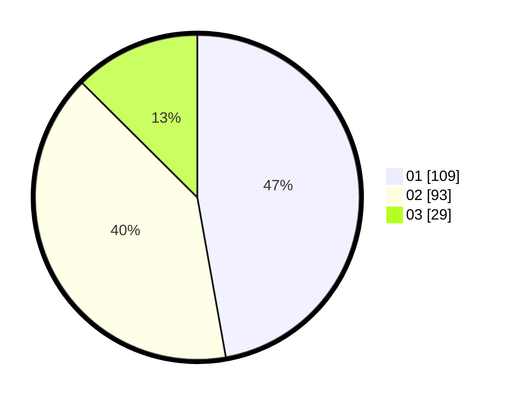

# Hasil

Hasil perolehan suara paslon dapat dilihat pada file paslon-01.txt, paslon-02.txt, dan paslon-03.txt.

Jika tidak ada, artinya data tersebut belum ada pada SIREKAP.

## Perolehan Suara

 * Paslon 01: **109**.
 * Paslon 02: **93**.
 * Paslon 03: **29**.

## Foto C Plano

https://sirekap-obj-formc.kpu.go.id/ddee/pemilu/ppwp/31/74/01/10/07/3174011007072-20240215-150426--22e070cc-1a91-4408-b6ef-b71a79933cf2.jpg

https://sirekap-obj-formc.kpu.go.id/ddee/pemilu/ppwp/31/74/01/10/07/3174011007072-20240215-235107--7f980d4d-b6c4-4a9b-8a04-5f70840c36e9.jpg

https://sirekap-obj-formc.kpu.go.id/ddee/pemilu/ppwp/31/74/01/10/07/3174011007072-20240214-235616--139288fc-12a3-4a25-a0c2-dca2a8a39b7b.jpg
