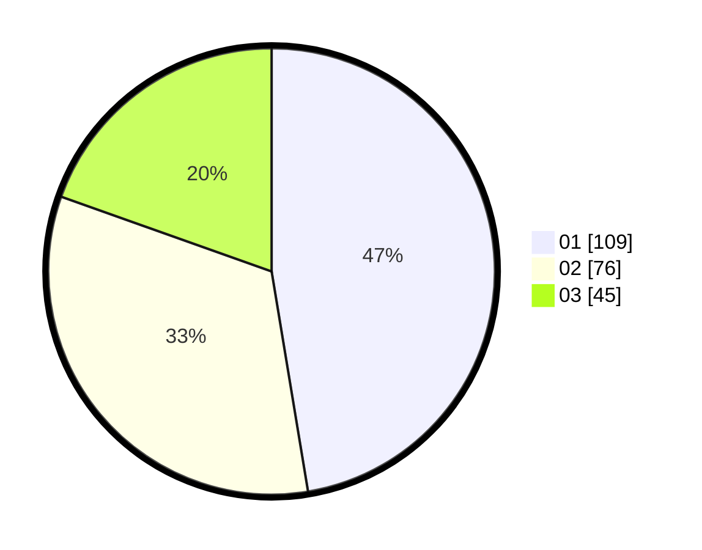

# Hasil

Hasil perolehan suara paslon dapat dilihat pada file paslon-01.txt, paslon-02.txt, dan paslon-03.txt.

Jika tidak ada, artinya data tersebut belum ada pada SIREKAP.

## Perolehan Suara

 * Paslon 01: **109**.
 * Paslon 02: **76**.
 * Paslon 03: **45**.

## Foto C Plano

https://sirekap-obj-formc.kpu.go.id/86a2/pemilu/ppwp/31/74/01/10/07/3174011007086-20240214-190834--d90d39ca-3354-413f-9489-31c317bd3669.jpg

https://sirekap-obj-formc.kpu.go.id/86a2/pemilu/ppwp/31/74/01/10/07/3174011007086-20240214-190956--b5a29415-b185-4a88-a49d-6888cb7f8062.jpg

https://sirekap-obj-formc.kpu.go.id/86a2/pemilu/ppwp/31/74/01/10/07/3174011007086-20240214-191057--146fe323-46c0-4465-82ca-ed99f03183f4.jpg

## DATA PEMILIH TETAP

Jumlah pemilih dalam DPT: **298**.
 * L: **152**.
 * P: **146**.

## DATA PENGGUNA HAK PILIH

Jumlah pengguna hak pilih dalam DPT: **234**.
 * L: **116**.
 * P: **118**.

Jumlah pengguna hak pilih dalam DPTb: **2**.
 * L: **1**.
 * P: **1**.

Jumlah pengguna hak pilih dalam DPK: **0**.
 * L: **0**.
 * P: **0**.

Jumlah pengguna hak pilih: **236**.
 * L: **117**.
 * P: **119**.

## JUMLAH SUARA SAH DAN TIDAK SAH

JUMLAH SELURUH SUARA SAH: **230**.

JUMLAH SUARA TIDAK SAH: **6**.

JUMLAH SELURUH SUARA SAH DAN SUARA TIDAK SAH: **236**.
