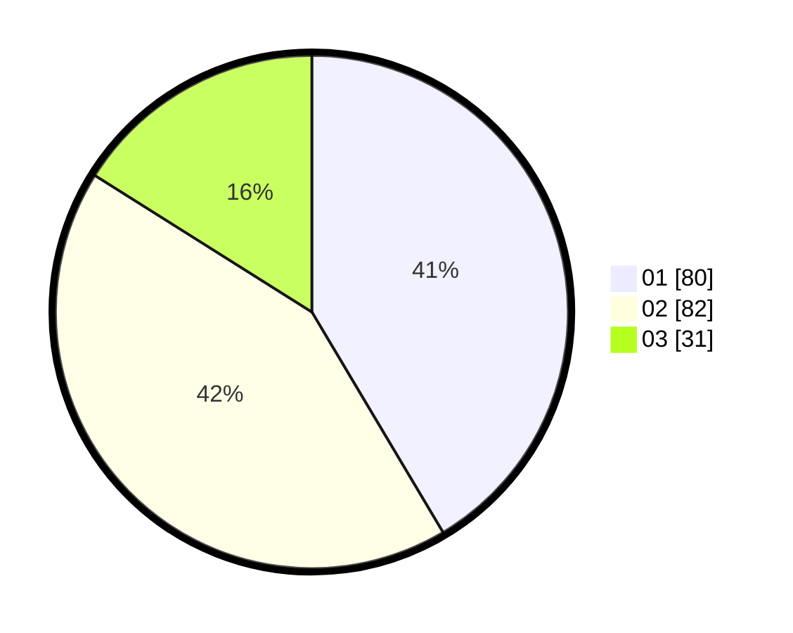

# Hasil

Hasil perolehan suara paslon dapat dilihat pada file paslon-01.txt, paslon-02.txt, dan paslon-03.txt.

Jika tidak ada, artinya data tersebut belum ada pada SIREKAP.

## Perolehan Suara

 * Paslon 01: **80**.
 * Paslon 02: **82**.
 * Paslon 03: **31**.

## Foto C Plano

https://sirekap-obj-formc.kpu.go.id/2f16/pemilu/ppwp/31/74/01/10/07/3174011007098-20240219-010044--96887313-2e8b-44bf-9f83-ced162da1a8c.jpg

https://sirekap-obj-formc.kpu.go.id/2f16/pemilu/ppwp/31/74/01/10/07/3174011007098-20240219-010458--37b2cbf9-7f57-43d8-9a7a-dee51f10a183.jpg

https://sirekap-obj-formc.kpu.go.id/2f16/pemilu/ppwp/31/74/01/10/07/3174011007098-20240219-010725--fc2ca486-d1e6-4624-bc5a-99eb9796cafb.jpg
