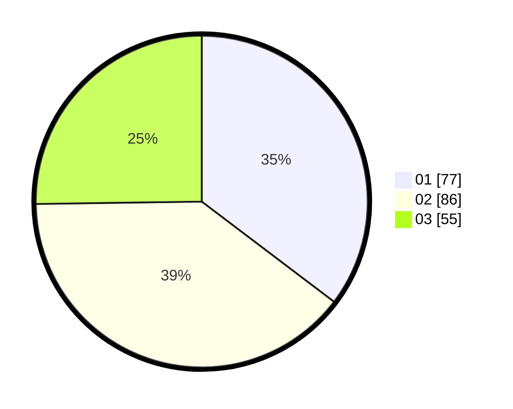

# Hasil

Hasil perolehan suara paslon dapat dilihat pada file paslon-01.txt, paslon-02.txt, dan paslon-03.txt.

Jika tidak ada, artinya data tersebut belum ada pada SIREKAP.

## Perolehan Suara

 * Paslon 01: **77**.
 * Paslon 02: **86**.
 * Paslon 03: **55**.

## Foto C Plano

https://sirekap-obj-formc.kpu.go.id/2a58/pemilu/ppwp/31/74/02/10/01/3174021001004-20240214-162223--4503319f-d6d3-41b8-88b6-c6e67008c591.jpg

https://sirekap-obj-formc.kpu.go.id/2a58/pemilu/ppwp/31/74/02/10/01/3174021001004-20240214-184628--74795396-8da7-43de-b7e0-9fbe344bc629.jpg

https://sirekap-obj-formc.kpu.go.id/2a58/pemilu/ppwp/31/74/02/10/01/3174021001004-20240214-184633--cbceec26-b0c5-413d-8c47-9301cfca7e5e.jpg
