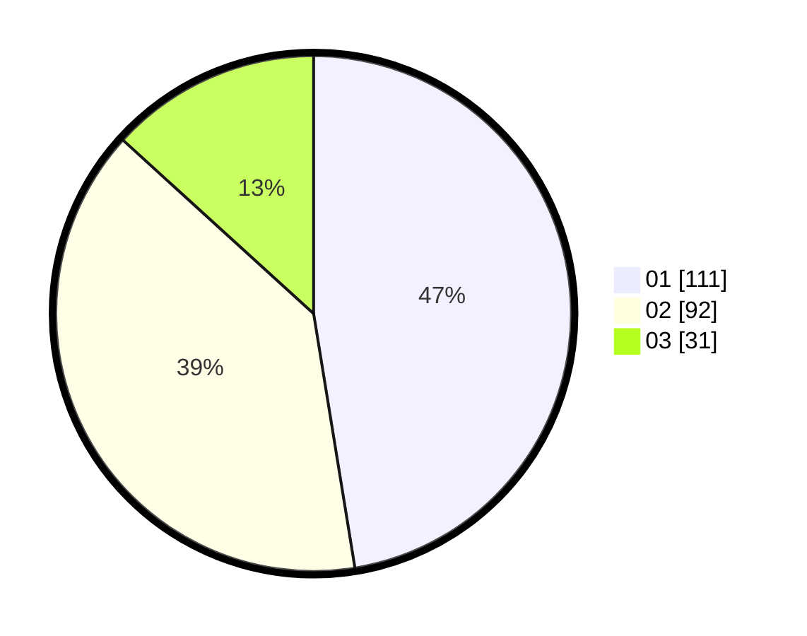

# Hasil

Hasil perolehan suara paslon dapat dilihat pada file paslon-01.txt, paslon-02.txt, dan paslon-03.txt.

Jika tidak ada, artinya data tersebut belum ada pada SIREKAP.

## Perolehan Suara

 * Paslon 01: **111**.
 * Paslon 02: **92**.
 * Paslon 03: **31**.

## Foto C Plano

https://sirekap-obj-formc.kpu.go.id/9878/pemilu/ppwp/31/74/02/10/01/3174021001006-20240214-213356--c46f4b15-204a-47d9-b7ab-7bba58cdece1.jpg

https://sirekap-obj-formc.kpu.go.id/9878/pemilu/ppwp/31/74/02/10/01/3174021001006-20240214-214000--9338bb20-c015-40fc-a647-d44296a35327.jpg

https://sirekap-obj-formc.kpu.go.id/9878/pemilu/ppwp/31/74/02/10/01/3174021001006-20240214-214114--f1549d3b-4d63-4ba8-847d-3e3dda494d2f.jpg
