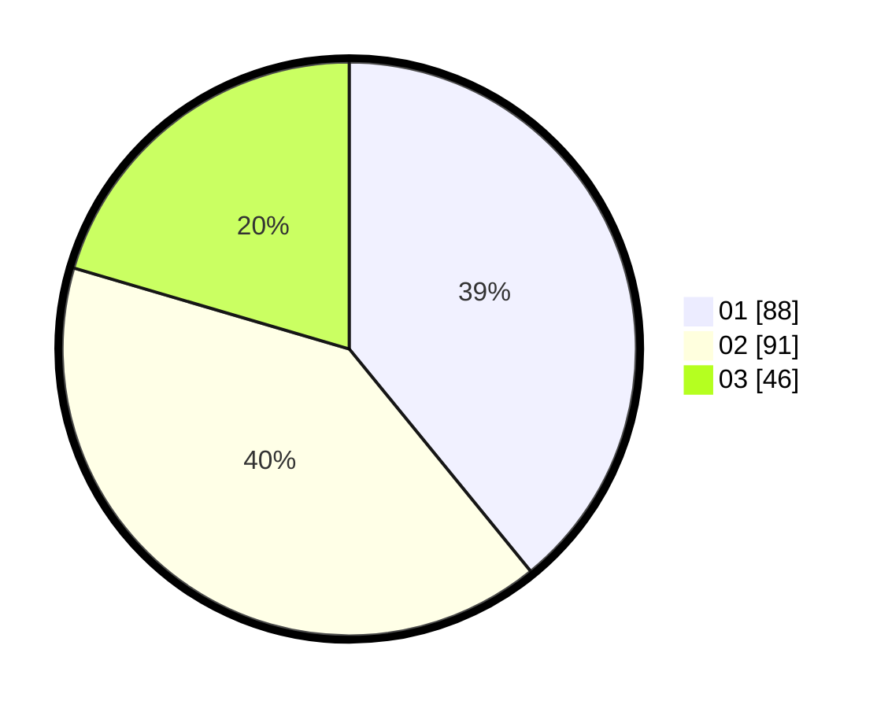

# Hasil

Hasil perolehan suara paslon dapat dilihat pada file paslon-01.txt, paslon-02.txt, dan paslon-03.txt.

Jika tidak ada, artinya data tersebut belum ada pada SIREKAP.

## Perolehan Suara

 * Paslon 01: **88**.
 * Paslon 02: **91**.
 * Paslon 03: **46**.

## Foto C Plano

https://sirekap-obj-formc.kpu.go.id/1baf/pemilu/ppwp/31/74/02/10/01/3174021001007-20240214-190805--a86d7a9f-98ff-4913-a84d-6eae96cb19d6.jpg

https://sirekap-obj-formc.kpu.go.id/1baf/pemilu/ppwp/31/74/02/10/01/3174021001007-20240214-191215--59baf611-9330-4290-ba45-766642a7da1a.jpg

https://sirekap-obj-formc.kpu.go.id/1baf/pemilu/ppwp/31/74/02/10/01/3174021001007-20240214-191335--d82d1e24-bf6a-4256-b7ea-8a6010fa4544.jpg

## DATA PEMILIH TETAP

Jumlah pemilih dalam DPT: **269**.
 * L: **139**.
 * P: **130**.

## DATA PENGGUNA HAK PILIH

Jumlah pengguna hak pilih dalam DPT: **197**.
 * L: **101**.
 * P: **96**.

Jumlah pengguna hak pilih dalam DPTb: **26**.
 * L: **8**.
 * P: **18**.

Jumlah pengguna hak pilih dalam DPK: **4**.
 * L: **2**.
 * P: **2**.

Jumlah pengguna hak pilih: **227**.
 * L: **111**.
 * P: **116**.

## JUMLAH SUARA SAH DAN TIDAK SAH

JUMLAH SELURUH SUARA SAH: **225**.

JUMLAH SUARA TIDAK SAH: **2**.

JUMLAH SELURUH SUARA SAH DAN SUARA TIDAK SAH: **227**.
