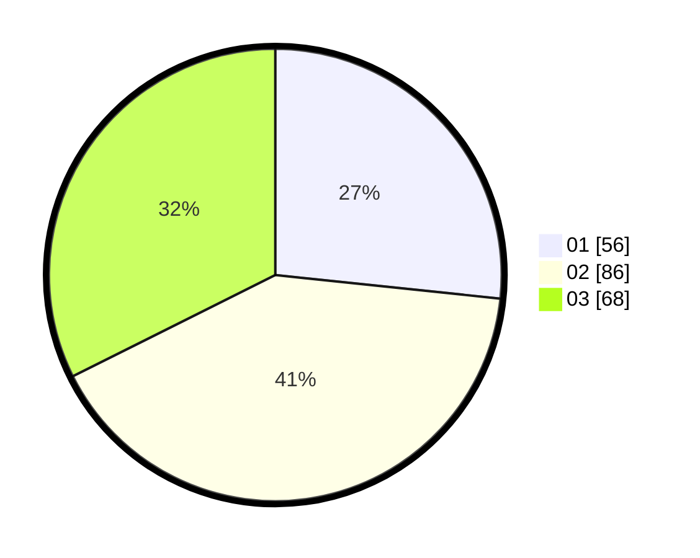

# Hasil

Hasil perolehan suara paslon dapat dilihat pada file paslon-01.txt, paslon-02.txt, dan paslon-03.txt.

Jika tidak ada, artinya data tersebut belum ada pada SIREKAP.

## Perolehan Suara

 * Paslon 01: **56**.
 * Paslon 02: **86**.
 * Paslon 03: **68**.

## Foto C Plano

https://sirekap-obj-formc.kpu.go.id/6b9f/pemilu/ppwp/31/74/02/10/02/3174021002003-20240216-071130--84d3bf91-606f-4fe3-ac2a-f3c7aa1a80fe.jpg

https://sirekap-obj-formc.kpu.go.id/6b9f/pemilu/ppwp/31/74/02/10/02/3174021002003-20240216-071131--1f925a64-6137-45f8-b2a1-e2748208fce8.jpg

https://sirekap-obj-formc.kpu.go.id/6b9f/pemilu/ppwp/31/74/02/10/02/3174021002003-20240216-071130--d1a9cf08-6e7a-4e35-8754-b4b8ada32753.jpg

## DATA PEMILIH TETAP

Jumlah pemilih dalam DPT: **261**.
 * L: **127**.
 * P: **134**.

## DATA PENGGUNA HAK PILIH

Jumlah pengguna hak pilih dalam DPT: **187**.
 * L: **93**.
 * P: **94**.

Jumlah pengguna hak pilih dalam DPTb: **23**.
 * L: **9**.
 * P: **14**.

Jumlah pengguna hak pilih dalam DPK: **1**.
 * L: **1**.
 * P: **0**.

Jumlah pengguna hak pilih: **211**.
 * L: **103**.
 * P: **108**.

## JUMLAH SUARA SAH DAN TIDAK SAH

JUMLAH SELURUH SUARA SAH: **210**.

JUMLAH SUARA TIDAK SAH: **1**.

JUMLAH SELURUH SUARA SAH DAN SUARA TIDAK SAH: **211**.
