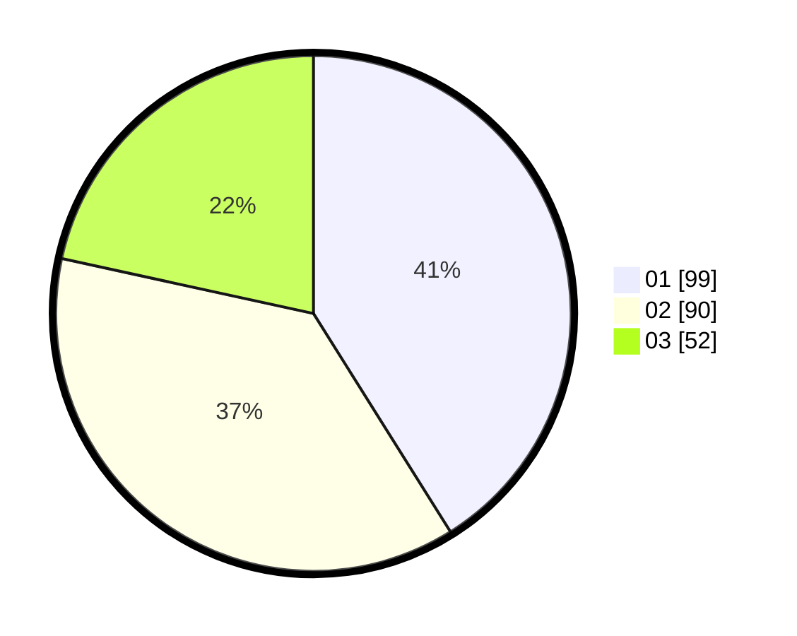

# Hasil

Hasil perolehan suara paslon dapat dilihat pada file paslon-01.txt, paslon-02.txt, dan paslon-03.txt.

Jika tidak ada, artinya data tersebut belum ada pada SIREKAP.

## Perolehan Suara

 * Paslon 01: **99**.
 * Paslon 02: **90**.
 * Paslon 03: **52**.

## Foto C Plano

https://sirekap-obj-formc.kpu.go.id/fcb9/pemilu/ppwp/31/74/02/10/04/3174021004002-20240217-192043--916dc7c2-8c87-4118-a9f5-86acb42f7792.jpg

https://sirekap-obj-formc.kpu.go.id/fcb9/pemilu/ppwp/31/74/02/10/04/3174021004002-20240217-194739--5cfc22ac-1a67-49e9-af7c-2d15ce81a34d.jpg

https://sirekap-obj-formc.kpu.go.id/fcb9/pemilu/ppwp/31/74/02/10/04/3174021004002-20240217-194517--cc33ec55-19c8-4b15-a45f-5f979f3b8c06.jpg

## DATA PEMILIH TETAP

Jumlah pemilih dalam DPT: **215**.
 * L: **112**.
 * P: **103**.

## DATA PENGGUNA HAK PILIH

Jumlah pengguna hak pilih dalam DPT: **215**.
 * L: **112**.
 * P: **103**.

Jumlah pengguna hak pilih dalam DPTb: **26**.
 * L: **14**.
 * P: **12**.

Jumlah pengguna hak pilih dalam DPK: **3**.
 * L: **2**.
 * P: **1**.

Jumlah pengguna hak pilih: **244**.
 * L: **128**.
 * P: **116**.

## JUMLAH SUARA SAH DAN TIDAK SAH

JUMLAH SELURUH SUARA SAH: **241**.

JUMLAH SUARA TIDAK SAH: **3**.

JUMLAH SELURUH SUARA SAH DAN SUARA TIDAK SAH: **244**.
