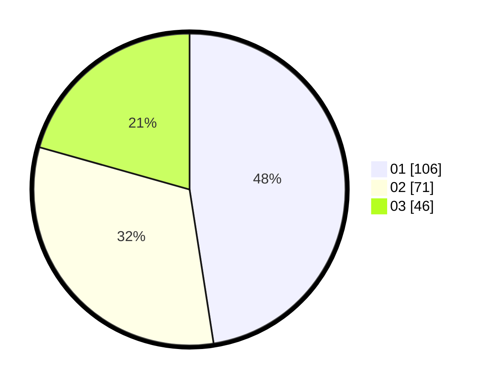

# Hasil

Hasil perolehan suara paslon dapat dilihat pada file paslon-01.txt, paslon-02.txt, dan paslon-03.txt.

Jika tidak ada, artinya data tersebut belum ada pada SIREKAP.

## Perolehan Suara

 * Paslon 01: **106**.
 * Paslon 02: **71**.
 * Paslon 03: **46**.

## Foto C Plano

https://sirekap-obj-formc.kpu.go.id/d653/pemilu/ppwp/31/74/02/10/04/3174021004018-20240214-193404--b72324d0-f0e7-4f00-b5b4-fcfa501e3ae2.jpg

https://sirekap-obj-formc.kpu.go.id/d653/pemilu/ppwp/31/74/02/10/04/3174021004018-20240214-195314--5a772f55-cc85-4125-b7d9-514f27d4c7d2.jpg

https://sirekap-obj-formc.kpu.go.id/d653/pemilu/ppwp/31/74/02/10/04/3174021004018-20240214-195506--8984937d-03d9-4f0b-85db-3b136fda8cf9.jpg

## DATA PEMILIH TETAP

Jumlah pemilih dalam DPT: **271**.
 * L: **141**.
 * P: **130**.

## DATA PENGGUNA HAK PILIH

Jumlah pengguna hak pilih dalam DPT: **200**.
 * L: **104**.
 * P: **96**.

Jumlah pengguna hak pilih dalam DPTb: **24**.
 * L: **4**.
 * P: **20**.

Jumlah pengguna hak pilih dalam DPK: **0**.
 * L: **0**.
 * P: **0**.

Jumlah pengguna hak pilih: **224**.
 * L: **108**.
 * P: **116**.

## JUMLAH SUARA SAH DAN TIDAK SAH

JUMLAH SELURUH SUARA SAH: **223**.

JUMLAH SUARA TIDAK SAH: **1**.

JUMLAH SELURUH SUARA SAH DAN SUARA TIDAK SAH: **224**.
