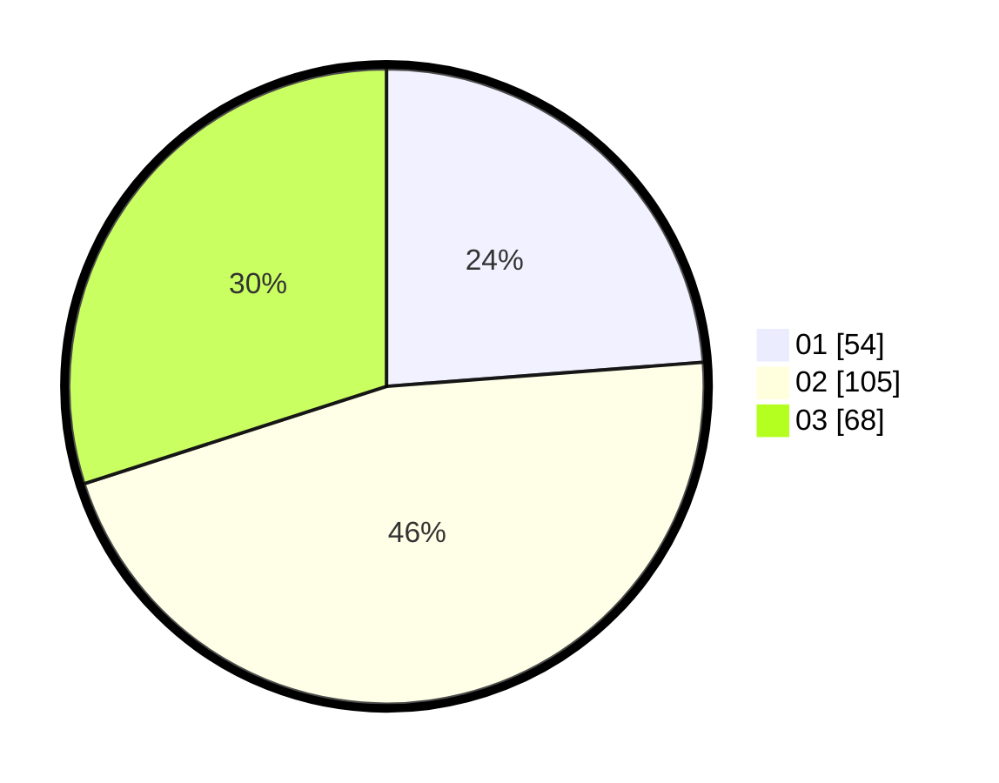

# Hasil

Hasil perolehan suara paslon dapat dilihat pada file paslon-01.txt, paslon-02.txt, dan paslon-03.txt.

Jika tidak ada, artinya data tersebut belum ada pada SIREKAP.

## Perolehan Suara

 * Paslon 01: **54**.
 * Paslon 02: **105**.
 * Paslon 03: **68**.

## Foto C Plano

https://sirekap-obj-formc.kpu.go.id/a018/pemilu/ppwp/31/74/02/10/04/3174021004021-20240214-221327--aa2c6c53-20b1-46d3-b07a-48a6df2748a4.jpg

https://sirekap-obj-formc.kpu.go.id/a018/pemilu/ppwp/31/74/02/10/04/3174021004021-20240214-221432--b8596126-011e-407b-b8b8-d8b430a49f48.jpg

https://sirekap-obj-formc.kpu.go.id/a018/pemilu/ppwp/31/74/02/10/04/3174021004021-20240214-221523--4c87dcfe-07be-46da-92d8-c36a74c3c079.jpg

## DATA PEMILIH TETAP

Jumlah pemilih dalam DPT: **292**.
 * L: **135**.
 * P: **157**.

## DATA PENGGUNA HAK PILIH

Jumlah pengguna hak pilih dalam DPT: **213**.
 * L: **97**.
 * P: **116**.

Jumlah pengguna hak pilih dalam DPTb: **20**.
 * L: **6**.
 * P: **14**.

Jumlah pengguna hak pilih dalam DPK: **3**.
 * L: **3**.
 * P: **0**.

Jumlah pengguna hak pilih: **236**.
 * L: **106**.
 * P: **130**.

## JUMLAH SUARA SAH DAN TIDAK SAH

JUMLAH SELURUH SUARA SAH: **227**.

JUMLAH SUARA TIDAK SAH: **9**.

JUMLAH SELURUH SUARA SAH DAN SUARA TIDAK SAH: **236**.
