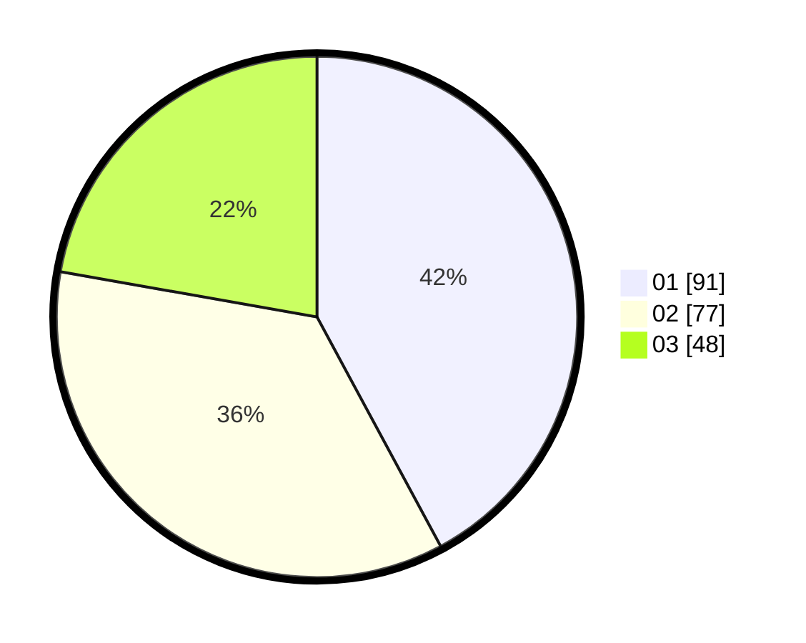

# Hasil

Hasil perolehan suara paslon dapat dilihat pada file paslon-01.txt, paslon-02.txt, dan paslon-03.txt.

Jika tidak ada, artinya data tersebut belum ada pada SIREKAP.

## Perolehan Suara

 * Paslon 01: **91**.
 * Paslon 02: **77**.
 * Paslon 03: **48**.

## Foto C Plano

https://sirekap-obj-formc.kpu.go.id/893b/pemilu/ppwp/31/74/02/10/04/3174021004029-20240214-184502--2b7c6c03-177f-46c7-8a03-db4f6d28a3c5.jpg

https://sirekap-obj-formc.kpu.go.id/893b/pemilu/ppwp/31/74/02/10/04/3174021004029-20240214-184913--99406082-f20c-4255-b3ad-7d6a2ecb2b40.jpg

https://sirekap-obj-formc.kpu.go.id/893b/pemilu/ppwp/31/74/02/10/04/3174021004029-20240214-185320--e9f83158-334b-42f5-aa88-578159c0e985.jpg

## DATA PEMILIH TETAP

Jumlah pemilih dalam DPT: **266**.
 * L: **139**.
 * P: **127**.

## DATA PENGGUNA HAK PILIH

Jumlah pengguna hak pilih dalam DPT: **195**.
 * L: **99**.
 * P: **96**.

Jumlah pengguna hak pilih dalam DPTb: **18**.
 * L: **8**.
 * P: **10**.

Jumlah pengguna hak pilih dalam DPK: **5**.
 * L: **2**.
 * P: **3**.

Jumlah pengguna hak pilih: **218**.
 * L: **109**.
 * P: **109**.

## JUMLAH SUARA SAH DAN TIDAK SAH

JUMLAH SELURUH SUARA SAH: **216**.

JUMLAH SUARA TIDAK SAH: **2**.

JUMLAH SELURUH SUARA SAH DAN SUARA TIDAK SAH: **218**.
