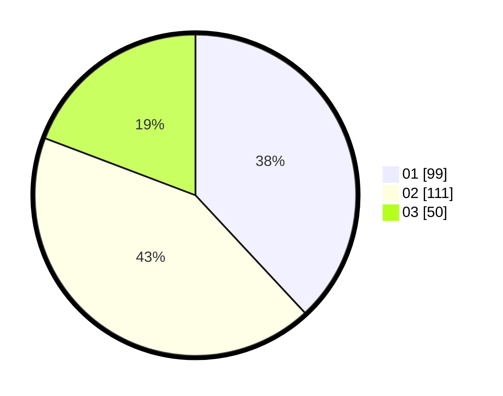

# Hasil

Hasil perolehan suara paslon dapat dilihat pada file paslon-01.txt, paslon-02.txt, dan paslon-03.txt.

Jika tidak ada, artinya data tersebut belum ada pada SIREKAP.

## Perolehan Suara

 * Paslon 01: **99**.
 * Paslon 02: **111**.
 * Paslon 03: **50**.

## Foto C Plano

https://sirekap-obj-formc.kpu.go.id/4095/pemilu/ppwp/31/74/02/10/05/3174021005022-20240215-022821--f956fcf7-9b92-4856-aea1-892fc0fb840c.jpg

https://sirekap-obj-formc.kpu.go.id/4095/pemilu/ppwp/31/74/02/10/05/3174021005022-20240215-023143--4696741f-7896-4be7-a4cc-cfd2e6e84b83.jpg

https://sirekap-obj-formc.kpu.go.id/4095/pemilu/ppwp/31/74/02/10/05/3174021005022-20240215-025123--a3ba77f7-a44e-4205-ad07-7189f45781ca.jpg

## DATA PEMILIH TETAP

Jumlah pemilih dalam DPT: **300**.
 * L: **151**.
 * P: **149**.

## DATA PENGGUNA HAK PILIH

Jumlah pengguna hak pilih dalam DPT: **255**.
 * L: **125**.
 * P: **130**.

Jumlah pengguna hak pilih dalam DPTb: **7**.
 * L: **4**.
 * P: **3**.

Jumlah pengguna hak pilih dalam DPK: **0**.
 * L: **0**.
 * P: **0**.

Jumlah pengguna hak pilih: **262**.
 * L: **129**.
 * P: **133**.

## JUMLAH SUARA SAH DAN TIDAK SAH

JUMLAH SELURUH SUARA SAH: **260**.

JUMLAH SUARA TIDAK SAH: **2**.

JUMLAH SELURUH SUARA SAH DAN SUARA TIDAK SAH: **262**.
