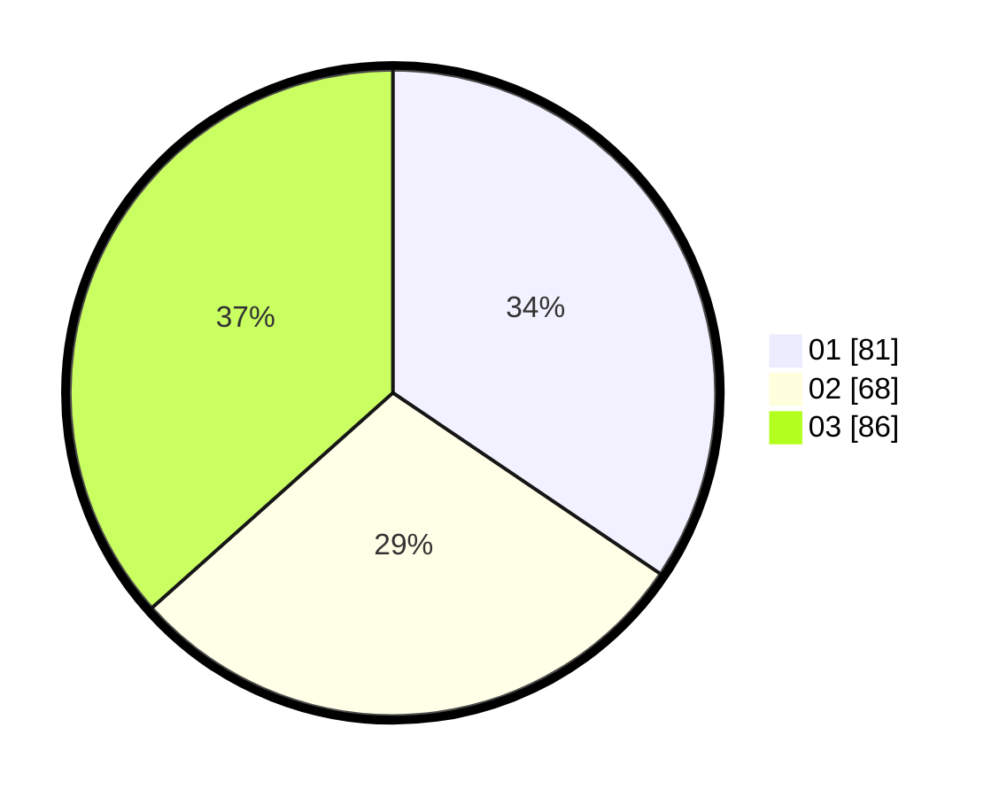

# Hasil

Hasil perolehan suara paslon dapat dilihat pada file paslon-01.txt, paslon-02.txt, dan paslon-03.txt.

Jika tidak ada, artinya data tersebut belum ada pada SIREKAP.

## Perolehan Suara

 * Paslon 01: **81**.
 * Paslon 02: **68**.
 * Paslon 03: **86**.

## Foto C Plano

https://sirekap-obj-formc.kpu.go.id/522a/pemilu/ppwp/31/74/02/10/05/3174021005060-20240214-211538--1d346175-b9a7-45dc-a60f-8798f22d4ed5.jpg

https://sirekap-obj-formc.kpu.go.id/522a/pemilu/ppwp/31/74/02/10/05/3174021005060-20240214-211628--bd950212-8613-4a4e-a7bb-dc11561284ba.jpg

https://sirekap-obj-formc.kpu.go.id/522a/pemilu/ppwp/31/74/02/10/05/3174021005060-20240214-211711--886c6f41-2947-4f19-9e9a-f5c7ea2f3078.jpg

## DATA PEMILIH TETAP

Jumlah pemilih dalam DPT: **295**.
 * L: **138**.
 * P: **157**.

## DATA PENGGUNA HAK PILIH

Jumlah pengguna hak pilih dalam DPT: **210**.
 * L: **98**.
 * P: **112**.

Jumlah pengguna hak pilih dalam DPTb: **23**.
 * L: **9**.
 * P: **14**.

Jumlah pengguna hak pilih dalam DPK: **3**.
 * L: **1**.
 * P: **2**.

Jumlah pengguna hak pilih: **236**.
 * L: **108**.
 * P: **128**.

## JUMLAH SUARA SAH DAN TIDAK SAH

JUMLAH SELURUH SUARA SAH: **235**.

JUMLAH SUARA TIDAK SAH: **1**.

JUMLAH SELURUH SUARA SAH DAN SUARA TIDAK SAH: **236**.
