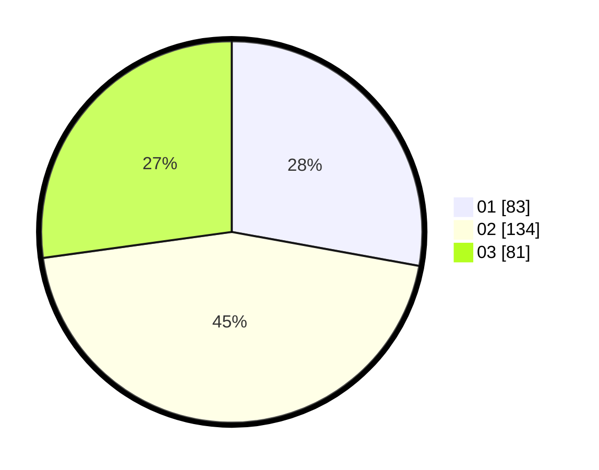

# Hasil

Hasil perolehan suara paslon dapat dilihat pada file paslon-01.txt, paslon-02.txt, dan paslon-03.txt.

Jika tidak ada, artinya data tersebut belum ada pada SIREKAP.

## Perolehan Suara

 * Paslon 01: **83**.
 * Paslon 02: **134**.
 * Paslon 03: **81**.

## Foto C Plano

https://sirekap-obj-formc.kpu.go.id/40af/pemilu/ppwp/31/74/02/10/05/3174021005067-20240214-195847--5950df10-6fc3-4dba-828f-afc7350c7e7c.jpg

https://sirekap-obj-formc.kpu.go.id/40af/pemilu/ppwp/31/74/02/10/05/3174021005067-20240214-193200--44e646fd-d1e2-4280-af06-0a51c79b22ee.jpg

https://sirekap-obj-formc.kpu.go.id/40af/pemilu/ppwp/31/74/02/10/05/3174021005067-20240214-201552--2514f534-b386-4881-9a2e-551a40cd374e.jpg

## DATA PEMILIH TETAP

Jumlah pemilih dalam DPT: **282**.
 * L: **121**.
 * P: **161**.

## DATA PENGGUNA HAK PILIH

Jumlah pengguna hak pilih dalam DPT: **204**.
 * L: **89**.
 * P: **115**.

Jumlah pengguna hak pilih dalam DPTb: **25**.
 * L: **16**.
 * P: **9**.

Jumlah pengguna hak pilih dalam DPK: **72**.
 * L: **28**.
 * P: **44**.

Jumlah pengguna hak pilih: **301**.
 * L: **133**.
 * P: **168**.

## JUMLAH SUARA SAH DAN TIDAK SAH

JUMLAH SELURUH SUARA SAH: **298**.

JUMLAH SUARA TIDAK SAH: **3**.

JUMLAH SELURUH SUARA SAH DAN SUARA TIDAK SAH: **301**.
