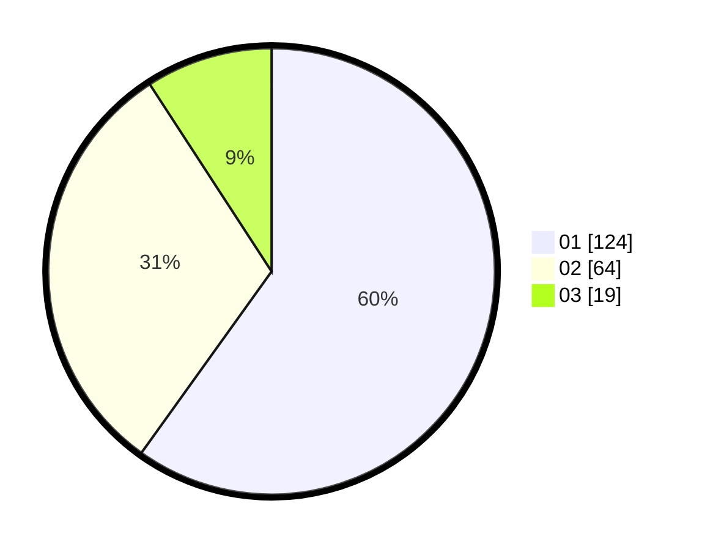

# Hasil

Hasil perolehan suara paslon dapat dilihat pada file paslon-01.txt, paslon-02.txt, dan paslon-03.txt.

Jika tidak ada, artinya data tersebut belum ada pada SIREKAP.

## Perolehan Suara

 * Paslon 01: **124**.
 * Paslon 02: **64**.
 * Paslon 03: **19**.

## Foto C Plano

https://sirekap-obj-formc.kpu.go.id/395b/pemilu/ppwp/31/74/02/10/05/3174021005068-20240216-072425--f8a2867f-5902-411a-a829-b06cea0ad109.jpg

https://sirekap-obj-formc.kpu.go.id/395b/pemilu/ppwp/31/74/02/10/05/3174021005068-20240216-072426--7d792d72-39f9-46ae-82e9-02ec9af33038.jpg

https://sirekap-obj-formc.kpu.go.id/395b/pemilu/ppwp/31/74/02/10/05/3174021005068-20240216-072426--d377145a-53a5-46ce-a377-2d9f113891b2.jpg

## DATA PEMILIH TETAP

Jumlah pemilih dalam DPT: **271**.
 * L: **133**.
 * P: **138**.

## DATA PENGGUNA HAK PILIH

Jumlah pengguna hak pilih dalam DPT: **205**.
 * L: **95**.
 * P: **110**.

Jumlah pengguna hak pilih dalam DPTb: **2**.
 * L: **2**.
 * P: **0**.

Jumlah pengguna hak pilih dalam DPK: **2**.
 * L: **1**.
 * P: **1**.

Jumlah pengguna hak pilih: **209**.
 * L: **98**.
 * P: **111**.

## JUMLAH SUARA SAH DAN TIDAK SAH

JUMLAH SELURUH SUARA SAH: **207**.

JUMLAH SUARA TIDAK SAH: **2**.

JUMLAH SELURUH SUARA SAH DAN SUARA TIDAK SAH: **209**.
