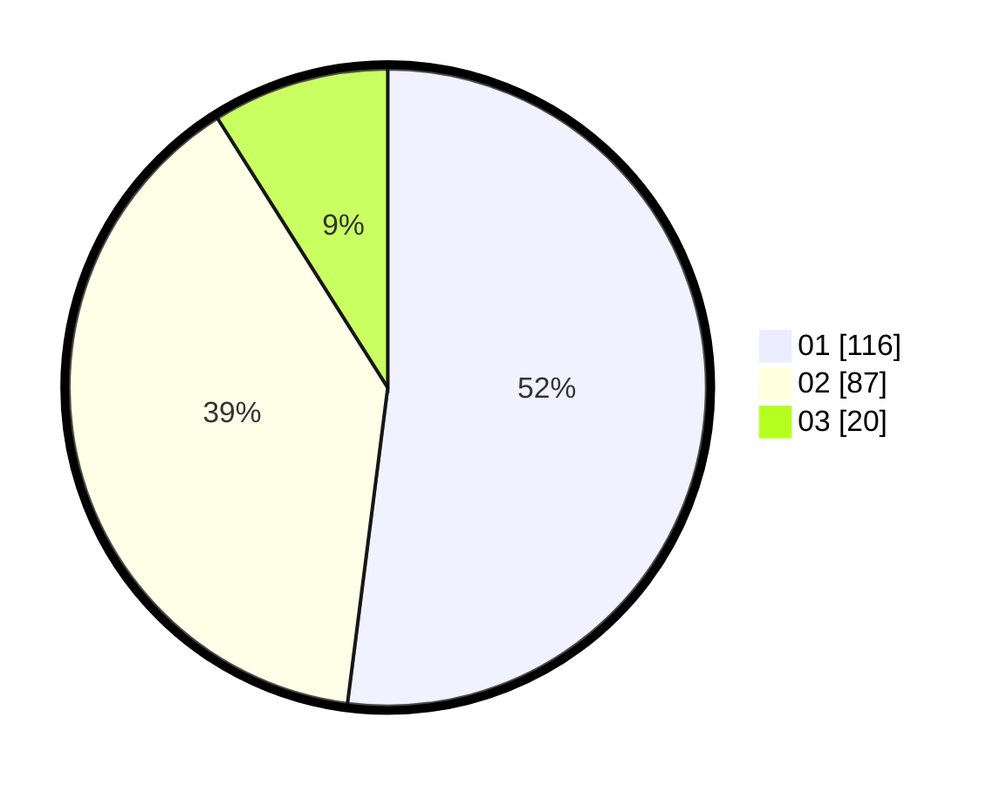

# Hasil

Hasil perolehan suara paslon dapat dilihat pada file paslon-01.txt, paslon-02.txt, dan paslon-03.txt.

Jika tidak ada, artinya data tersebut belum ada pada SIREKAP.

## Perolehan Suara

 * Paslon 01: **116**.
 * Paslon 02: **87**.
 * Paslon 03: **20**.

## Foto C Plano

https://sirekap-obj-formc.kpu.go.id/99c4/pemilu/ppwp/31/74/02/10/05/3174021005070-20240215-011521--20ac0b59-78e8-48e6-bc19-5f4bb36ab2b4.jpg

https://sirekap-obj-formc.kpu.go.id/99c4/pemilu/ppwp/31/74/02/10/05/3174021005070-20240215-011716--f5de442d-7094-4160-ad56-f7b5d544065e.jpg

https://sirekap-obj-formc.kpu.go.id/99c4/pemilu/ppwp/31/74/02/10/05/3174021005070-20240215-011914--5c2f7bfa-93a0-4192-8531-946a94d75b7f.jpg

## DATA PEMILIH TETAP

Jumlah pemilih dalam DPT: **260**.
 * L: **125**.
 * P: **135**.

## DATA PENGGUNA HAK PILIH

Jumlah pengguna hak pilih dalam DPT: **223**.
 * L: **105**.
 * P: **118**.

Jumlah pengguna hak pilih dalam DPTb: **0**.
 * L: **0**.
 * P: **0**.

Jumlah pengguna hak pilih dalam DPK: **0**.
 * L: **0**.
 * P: **0**.

Jumlah pengguna hak pilih: **223**.
 * L: **105**.
 * P: **118**.

## JUMLAH SUARA SAH DAN TIDAK SAH

JUMLAH SELURUH SUARA SAH: **223**.

JUMLAH SUARA TIDAK SAH: **0**.

JUMLAH SELURUH SUARA SAH DAN SUARA TIDAK SAH: **223**.
