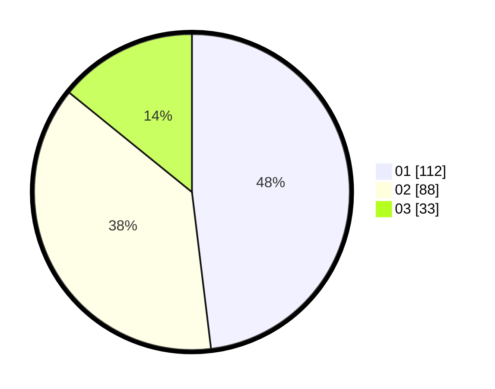

# Hasil

Hasil perolehan suara paslon dapat dilihat pada file paslon-01.txt, paslon-02.txt, dan paslon-03.txt.

Jika tidak ada, artinya data tersebut belum ada pada SIREKAP.

## Perolehan Suara

 * Paslon 01: **112**.
 * Paslon 02: **88**.
 * Paslon 03: **33**.

## Foto C Plano

https://sirekap-obj-formc.kpu.go.id/0497/pemilu/ppwp/31/74/02/10/05/3174021005079-20240214-233049--2beba869-944b-412c-b8fc-a3d9e4a03d41.jpg

https://sirekap-obj-formc.kpu.go.id/0497/pemilu/ppwp/31/74/02/10/05/3174021005079-20240214-233211--9dec95fc-64d8-4428-b18d-8bff90fe3e6a.jpg

https://sirekap-obj-formc.kpu.go.id/0497/pemilu/ppwp/31/74/02/10/05/3174021005079-20240214-233314--34fd9b90-9564-4752-9e71-4c81bd0c36da.jpg

## DATA PEMILIH TETAP

Jumlah pemilih dalam DPT: **280**.
 * L: **138**.
 * P: **142**.

## DATA PENGGUNA HAK PILIH

Jumlah pengguna hak pilih dalam DPT: **223**.
 * L: **107**.
 * P: **116**.

Jumlah pengguna hak pilih dalam DPTb: **0**.
 * L: **0**.
 * P: **0**.

Jumlah pengguna hak pilih dalam DPK: **15**.
 * L: **8**.
 * P: **7**.

Jumlah pengguna hak pilih: **238**.
 * L: **115**.
 * P: **123**.

## JUMLAH SUARA SAH DAN TIDAK SAH

JUMLAH SELURUH SUARA SAH: **233**.

JUMLAH SUARA TIDAK SAH: **5**.

JUMLAH SELURUH SUARA SAH DAN SUARA TIDAK SAH: **238**.
