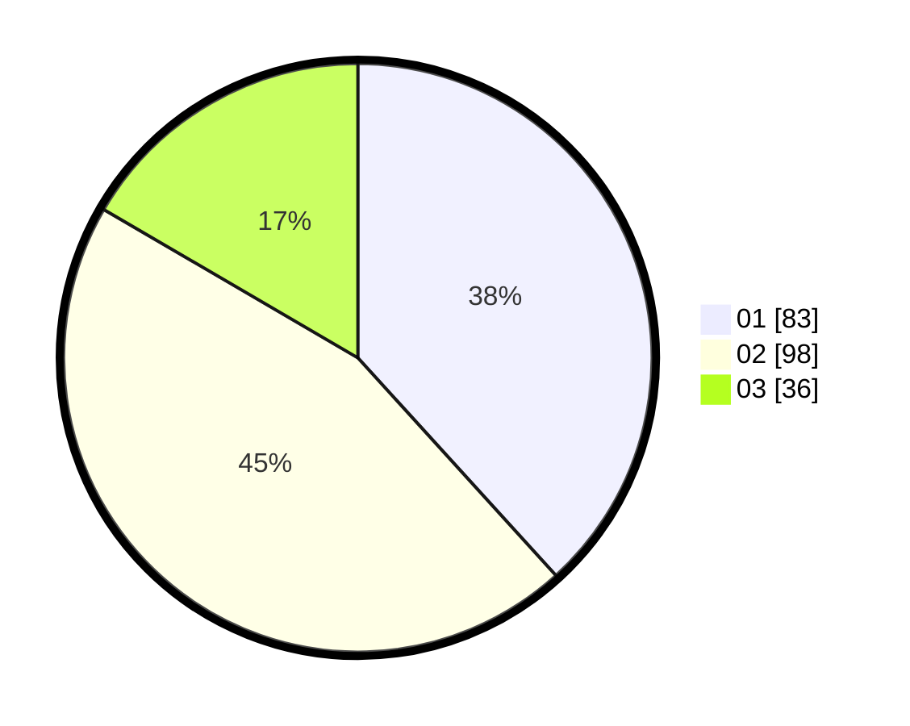

# Hasil

Hasil perolehan suara paslon dapat dilihat pada file paslon-01.txt, paslon-02.txt, dan paslon-03.txt.

Jika tidak ada, artinya data tersebut belum ada pada SIREKAP.

## Perolehan Suara

 * Paslon 01: **83**.
 * Paslon 02: **98**.
 * Paslon 03: **36**.

## Foto C Plano

https://sirekap-obj-formc.kpu.go.id/9b0e/pemilu/ppwp/31/74/02/10/05/3174021005089-20240214-231731--6e7a13e7-0b47-45c8-afa8-30a6d8eb0d59.jpg

https://sirekap-obj-formc.kpu.go.id/9b0e/pemilu/ppwp/31/74/02/10/05/3174021005089-20240214-231853--4982788f-3e26-41f0-a4fd-d6cd01da7f7d.jpg

https://sirekap-obj-formc.kpu.go.id/9b0e/pemilu/ppwp/31/74/02/10/05/3174021005089-20240214-232056--2ac1d359-3cf9-40dd-9e02-3074a7a62a48.jpg
