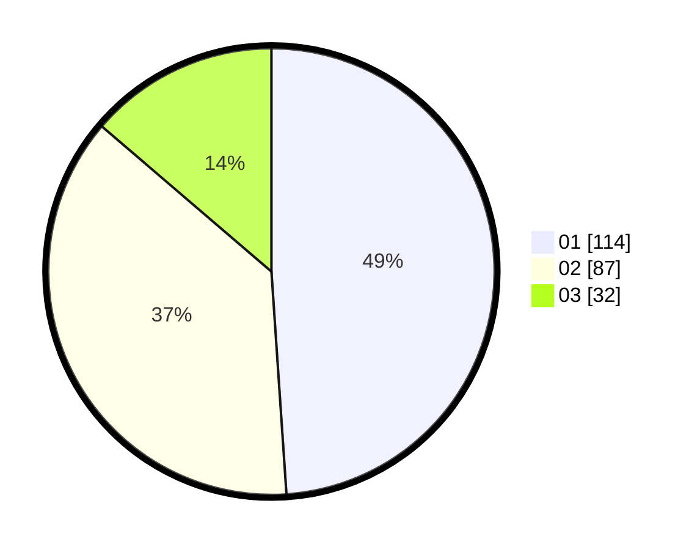

# Hasil

Hasil perolehan suara paslon dapat dilihat pada file paslon-01.txt, paslon-02.txt, dan paslon-03.txt.

Jika tidak ada, artinya data tersebut belum ada pada SIREKAP.

## Perolehan Suara

 * Paslon 01: **114**.
 * Paslon 02: **87**.
 * Paslon 03: **32**.

## Foto C Plano

https://sirekap-obj-formc.kpu.go.id/892d/pemilu/ppwp/31/74/02/10/05/3174021005096-20240217-210635--81903319-6aa8-44f9-8380-02068e716a11.jpg

https://sirekap-obj-formc.kpu.go.id/892d/pemilu/ppwp/31/74/02/10/05/3174021005096-20240217-211859--aebc2971-0168-4a42-a044-1de6443a5aff.jpg

https://sirekap-obj-formc.kpu.go.id/892d/pemilu/ppwp/31/74/02/10/05/3174021005096-20240217-213452--1158b36c-e535-460c-bcef-e4f38bf7e3f9.jpg

## DATA PEMILIH TETAP

Jumlah pemilih dalam DPT: **288**.
 * L: **139**.
 * P: **149**.

## DATA PENGGUNA HAK PILIH

Jumlah pengguna hak pilih dalam DPT: **221**.
 * L: **104**.
 * P: **117**.

Jumlah pengguna hak pilih dalam DPTb: **15**.
 * L: **6**.
 * P: **9**.

Jumlah pengguna hak pilih dalam DPK: **1**.
 * L: **0**.
 * P: **1**.

Jumlah pengguna hak pilih: **237**.
 * L: **110**.
 * P: **127**.

## JUMLAH SUARA SAH DAN TIDAK SAH

JUMLAH SELURUH SUARA SAH: **233**.

JUMLAH SUARA TIDAK SAH: **4**.

JUMLAH SELURUH SUARA SAH DAN SUARA TIDAK SAH: **237**.
